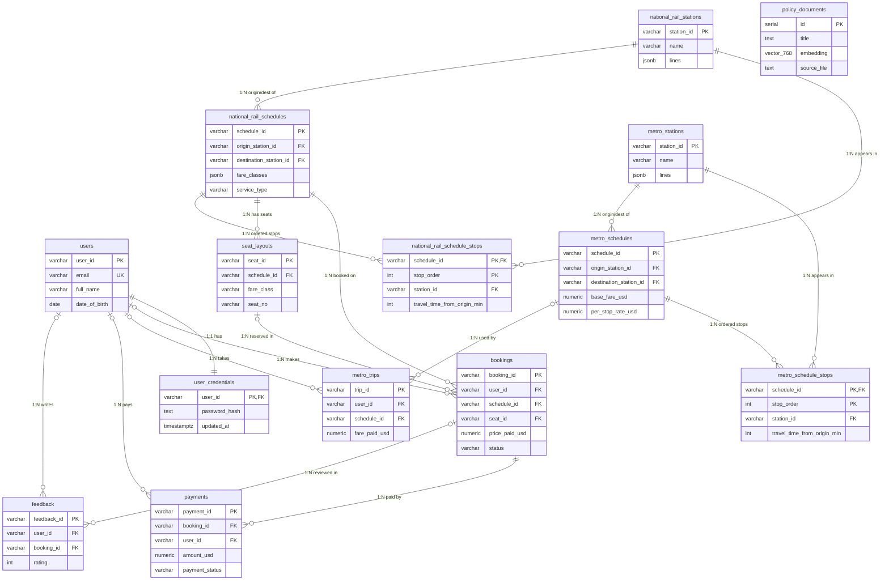

# TransitFlow Design Document — Team 45

**Team Members:** 郭明儒 (114423010, Team Leader) · 卓少筠 (113403005) · 林楷崋 (113403018)

## Section 1 — Entity-Relationship Diagram



The diagram uses crow's-foot notation, where the symbol *on each line* states the cardinality of both ends. `||` is "exactly one", `o{` is "zero or many", and `|o` is "zero or one". The `|o` (optional one) appears wherever the child's foreign key is nullable and uses `ON DELETE SET NULL`: for example `users |o--o{ bookings` means a booking *may* reference a user, but `bookings.user_id` is set to `NULL` if that user is deleted, so the financial/audit row survives. By contrast `national_rail_schedules ||--o{ bookings` is a mandatory one (a booking must reference a real schedule, enforced with `ON DELETE RESTRICT`), and `users ||--|| user_credentials` is a strict 1:1 because credentials share the user's primary key and cascade-delete with the user.

`policy_documents` is intentionally drawn with no relationships: it is the Retrieval-Augmented-Generation (RAG) vector store, holding policy text plus a `vector(768)` embedding, and is reached only by similarity search — it is never joined to operational tables, so adding a foreign key would be meaningless. The conceptually many-to-many relationship between a schedule and the stations it visits ("a schedule passes through many stations; a station appears in many schedules") is resolved by the two associative entities `metro_schedule_stops` and `national_rail_schedule_stops`. Each carries the relationship's own attributes — `stop_order` (0-based position) and `travel_time_from_origin_min` — and uses the composite primary key `(schedule_id, stop_order)`, which is the textbook decomposition of an M:N relationship with attributes into a junction table.

## Section 2 — Normalisation Justification

### 2.1 Schedule stops: junction table (3NF decision)

The earlier design stored the ordered stops directly inside each schedule row as a `stops_in_order` JSONB array, with a parallel `travel_time_from_origin_min` JSONB array holding one number per stop. This is unsatisfactory on several concrete counts:

- **1NF violation (non-atomic columns).** A single column held a list of stops; the position of an element carried meaning, which is exactly the repeating-group anti-pattern 1NF forbids.
- **Hidden update anomaly.** The stops array and the travel-time array were two independent lists that had to be kept index-aligned by hand. Inserting one stop required editing two columns in lock-step; nothing in the database prevented them from drifting out of sync.
- **No referential integrity.** A stop was just a string inside JSON, so the database could not guarantee it named a real station — a typo such as `"NR99"` would be accepted silently.
- **Poor query shape.** "Is there service from A to B on this schedule, and how long does it take?" required scanning every schedule, parsing the JSON in Python, and locating both stations by array position — a full scan plus application-side logic that no index could accelerate.

The new design extracts a junction relation `metro_schedule_stops(schedule_id, station_id, stop_order, travel_time_from_origin_min)` (and the rail twin `national_rail_schedule_stops`). It is in 3NF:

- **Composite primary key `(schedule_id, stop_order)`.** Every non-key attribute (`station_id`, `travel_time_from_origin_min`) is functionally dependent on the *whole* key and on nothing but the key — there are no partial dependencies (2NF) and no transitive dependencies through a non-key attribute (3NF).
- **`UNIQUE (schedule_id, station_id)`** forbids a schedule from listing the same station twice. This pair is in fact a second *candidate key* of the relation — either composite could serve as the primary key; we chose `(schedule_id, stop_order)` as the primary key because ordered traversal is the dominant access pattern, and enforce the other candidate key with the UNIQUE constraint.
- **Foreign keys with deliberate delete rules:** `schedule_id` references the schedule with `ON DELETE CASCADE` (stops are meaningless without their schedule), and `station_id` references the station table with `ON DELETE RESTRICT` (a station that is still part of a route cannot be silently removed). A supporting index on `station_id` backs reverse look-ups.

The change is visible in the query shape. Availability between an origin and a destination is now a single set-based self-join over the junction table, with the ordering enforced by `stop_order`:

```sql
-- abbreviated from the availability / fare queries in queries.py
JOIN national_rail_schedule_stops o ON o.schedule_id = s.schedule_id
JOIN national_rail_schedule_stops d ON d.schedule_id = s.schedule_id
WHERE o.station_id = %s
  AND d.station_id = %s
  AND o.stop_order < d.stop_order;   -- destination must come after origin
```

This is index-backed and declarative; the count of intermediate stops (used for fare maths) is simply `d.stop_order - o.stop_order`, with no JSON parsing in Python.

### 2.2 Password storage

Credentials live in `user_credentials.password_hash` and are hashed with **Argon2id** via the `argon2-cffi` library (`PasswordHasher`).

- **Why not MD5 or SHA-1.** Those are *fast, general-purpose* digests designed to hash large messages quickly. That speed is the problem for passwords: commodity GPUs compute billions of MD5/SHA-1 hashes per second, so an offline brute-force or dictionary attack against a leaked hash table is cheap. SHA-1 additionally has a demonstrated practical collision (the SHAttered attack, 2017), and neither algorithm includes a salt or any deliberate cost.
- **Why Argon2id.** Argon2id is a *memory-hard key-derivation function* with three independently configurable cost parameters — time cost (iterations), memory cost (KiB used), and parallelism. Making each guess expensive in memory as well as CPU defeats the economics of GPU/ASIC cracking, because attackers can no longer trade cheap silicon for throughput. This deliberate slowness (key stretching) is the feature, not a bug.
- **Salting.** `argon2-cffi` generates a random per-password salt and embeds it in the self-describing encoded hash string. Two users with the same password therefore get different stored hashes, which makes precomputed rainbow tables useless.
- **Single source of truth.** The seeder and the runtime verification path (`login_user` → `_verify_password`) use the *same* `PasswordHasher` instance/settings, so hashes are produced and checked consistently. `_verify_password` also returns the result of `check_needs_rehash`, letting the system transparently re-hash a password with upgraded parameters the next time the user logs in.

### 2.3 Deliberate denormalisation kept

Four JSONB columns are retained on purpose: `fare_classes` and `operates_on` on the schedule tables, `lines` on the station tables, and `passed_through_stations` on `national_rail_schedules`. The justification is concrete, not "JSON is convenient":

- They are **read-only display/configuration attributes** — fare-class labels, days of operation, line tags — rendered to the UI or used as filters, never updated piecemeal.
- They are **never used as a join key** and need **no referential-integrity constraint**, so a junction table would buy nothing.
- Decomposing them would add three to four extra tables (and joins) for *zero* query benefit.

The rule applied throughout is simple: anything that participates in a join or a constraint is fully normalised; data that is only ever read back whole is allowed to stay as a JSONB document (and is still indexed with GIN indexes where filtering is needed).

## Section 3 — Graph Database Design Rationale

**Nodes, relationships, and properties.** The network topology is modelled in Neo4j. A **node** is a `Station`, additionally labelled `MetroStation` or `NationalRailStation` so each sub-network can be queried in isolation. Node identity is the business key `station_id`, enforced by `CREATE CONSTRAINT station_id_unique IF NOT EXISTS` (a uniqueness constraint that also creates a backing index). **Relationships** are directed edges between stations: `METRO_LINK` and `RAIL_LINK` model intra-network adjacency (seeded as directional pairs), while `INTERCHANGE_TO` models a cross-network transfer and is seeded in *both* directions with `travel_time_min = 5` and a fare of `0.0` (transferring between the metro and rail platforms is free). Edge **properties** hold the routing weights: `travel_time_min` (integer), `fare_standard`, and `fare_first`. On rail links `fare_standard = travel_time_min * 0.35` and `fare_first = travel_time_min * 0.60`; metro links use a flat standard fare.

**Why a graph beats the relational store for this workload.** Route planning is a *transitive-closure* problem over an adjacency relation — "find a path of unknown length from A to B" — which is precisely what relational algebra handles badly. In PostgreSQL the only native tool is a `WITH RECURSIVE` CTE, which forces the application to: carry a visited-path array to avoid cycles manually, impose an arbitrary depth cap, and pay a join cost that grows with every level of recursion, all *without* native weighted-priority expansion (you cannot tell the recursion to explore the cheapest frontier first). Neo4j instead stores adjacency as direct node-to-node pointers (index-free adjacency), so traversal cost depends on the size of the *answer*, not the size of the tables. A single call to `apoc.algo.dijkstra(start, end, 'METRO_LINK>|RAIL_LINK>|INTERCHANGE_TO>', 'travel_time_min')` returns the weighted shortest path with the correct algorithm (Dijkstra) doing the priority-queue work for us.

**Worked example 1 — shortest route.** The actual Cypher from `query_shortest_route` (abbreviated):

```cypher
MATCH (start:Station {station_id: $origin_id})
MATCH (end:Station   {station_id: $destination_id})
CALL apoc.algo.dijkstra(
    start, end,
    'METRO_LINK>|RAIL_LINK>|INTERCHANGE_TO>',
    'travel_time_min'
) YIELD path, weight
RETURN weight AS total_time,
       [n IN nodes(path)         | n.station_id] AS stations,
       [r IN relationships(path) | r.travel_time_min] AS legs;
```

The relational equivalent has to reinvent the traversal by hand:

```sql
WITH RECURSIVE route(curr, dest, total_min, path, depth) AS (
    SELECT origin_id, origin_id, 0, ARRAY[origin_id], 0
    UNION ALL
    SELECT e.to_station, r.dest, r.total_min + e.travel_time_min,
           r.path || e.to_station, r.depth + 1
    FROM route r
    JOIN station_edges e ON e.from_station = r.curr
    WHERE e.to_station <> ALL(r.path)   -- manual cycle avoidance
      AND r.depth < 12                  -- arbitrary depth cap
)
SELECT path, total_min FROM route
WHERE curr = $destination_id
ORDER BY total_min LIMIT 1;            -- "shortest" only after full enumeration
```

Note the recursive CTE enumerates *all* simple paths and only picks the minimum afterwards — there is no priority-driven early termination, so it does strictly more work than Dijkstra.

**Worked example 2 — delay ripple.** "Which stations are within N hops of a delayed station, and how far away?" uses a variable-length pattern with hop bookkeeping (from `query_delay_ripple`):

```cypher
MATCH p = (start:Station {station_id: $station_id})
          -[:METRO_LINK|RAIL_LINK|INTERCHANGE_TO*1..N]-(affected:Station)
WITH affected, min(length(p)) AS hops_away
RETURN affected.station_id, hops_away
ORDER BY hops_away ASC;
```

The `min(length(p))` keeps the shortest distance when a station is reachable by several paths. In SQL this is again an iterative CTE (or N self-joins) that has to track and `MIN`/`GREATEST` the hop count per station manually.

**Fare-class routing.** The cheapest-route query (`query_cheapest_route`) reuses the same Dijkstra call but swaps the *weight property* from a small whitelist: `weight_property = "fare_first" if fare_class == "first" else "fare_standard"`. Because first class costs more per minute on rail (`0.60` vs `0.35`), a first-class request can return a different total — and sometimes a different path — than a standard request over the identical topology. The whitelist is what keeps the property swap injection-safe.

## Section 4 — Vector / RAG Design

**What is embedded, and why cosine similarity.** The 13 policy documents (refund policy, ticket types, booking rules, travel policies) are embedded because they are the free-text knowledge the assistant must quote accurately — unlike schedules or fares, they cannot be answered from relational rows. Cosine similarity is the right metric for this search because it is *magnitude-independent*: it compares only the **direction** of two vectors (`cos θ = A·B / |A||B|`), not their length. Embedding magnitude varies with document length and token statistics, so two texts about the same topic — a one-line user question and a full policy paragraph — still score as highly similar when their vectors point the same way. A magnitude-sensitive metric such as raw Euclidean distance would systematically penalise short queries against long documents.

**RAG pipeline (numbered).**

1. The user's message is converted to an embedding vector by the configured provider (`llm_provider.py`).
2. `query_policy_vector_search` runs a cosine-similarity search over `policy_documents` using pgvector — `1 - (embedding <=> %s::vector)` as the similarity score, accelerated by the HNSW cosine index (`idx_policy_documents_embedding`). It keeps rows above the `VECTOR_SIMILARITY_THRESHOLD` of `0.5` and returns the top `VECTOR_TOP_K = 3`.
3. The retrieved policy chunks are injected into the system prompt as grounding context.
4. The LLM answers using that context, so the reply is grounded in real policy text rather than the model's parametric memory.
5. The same agent can additionally call SQL and graph tools, so a single answer can combine retrieved policy text with live database facts.

**Embedding dimensions.**

| Provider | Model | Dimension |
|----------|-------|-----------|
| Ollama | nomic-embed-text | 768 |
| Gemini | gemini-embedding-001 | 3072 |

The schema column is `vector(768)`, matching the default Ollama provider.

**Dimension-mismatch hazard (required).** Embeddings are seeded at 768 dimensions, so the stored vectors and the HNSW index are *dimension-bound* to 768. If the provider were switched to Gemini, every query embedding would be 3072-dimensional, and pgvector raises a hard dimension-mismatch error when comparing a 3072-d query vector against a 768-d column — the search simply cannot run. Changing providers is therefore not a config flip: it requires `ALTER`ing the column type to the new dimension, dropping and rebuilding the HNSW index, *and* re-embedding every document from scratch. We mitigate this by pinning a single provider through the `LLM_PROVIDER` environment variable so seeding and querying always agree.

## Section 5 — AI Tool Usage Evidence

The cases below are drawn from the project's development log; each one shows how the AI output was *validated* rather than trusted.

| # | Context | Prompt (summary) | Outcome |
|---|---------|------------------|---------|
| 1 | Implementing the metro↔rail transfer relationships in Neo4j | "Design the graph schema for interchanges between the metro and national rail networks" | **AI got it wrong:** the assistant named the relationship `INTERCHANGES_WITH`, but the assignment spec requires `INTERCHANGE_TO`. Caught while cross-checking the grading guide; renamed in the seeder and every graph query, and added a simulation check asserting zero legacy relationship names remain. |
| 2 | Merging the password-security branch | "Refactor password hashing/verification into shared helpers" | **AI got it wrong:** after the merge, `_hash_password` / `_verify_password` were referenced 5 times but defined nowhere, and the `contextmanager` import was lost — login/register crashed with NameError. Diagnosed with a repo-wide grep, re-implemented both helpers with Argon2id using the same PasswordHasher settings as the seeder. |
| 3 | Designing schedule-stop storage | "Design the schema for storing the ordered stops of each schedule" | **AI got it wrong:** the first design stored stops as a JSONB array, which the grading guide explicitly disallows. Rebuilt as junction tables with 0-based stop_order, composite PK, and FKs; rewrote seeder and five query functions to JOIN through them. |
| 4 | Writing the delay-ripple query | "Write a Cypher query returning all stations within N hops of a delayed station" | **AI got it wrong:** it parameterised the variable-length upper bound (`*1..$hops`), which Cypher does not support — syntax error at runtime. Replaced with a clamped integer interpolation (`max(1, min(int(hops), 10))`) and documented why. |

## Section 6 — Reflection & Trade-offs

1. **Natural VARCHAR keys vs UUID/SERIAL.** We chose human-readable business keys (`MS01`, `NR_SCH01`, `BK-XXXXXX`) because the mock dataset ships with stable, cross-referenced identifiers and readable keys make graded query output easy to inspect. The cost is that natural keys are guessable and enumerable. For production we would move operational tables to opaque UUIDs to prevent enumeration attacks and ID-collision risk across data sources.

2. **Junction table vs JSONB for schedule stops.** Normalising the stops gives us referential integrity and index-backed ordering queries (the `stop_order` self-join), at the price of more complex seeding and one extra JOIN whenever a full route needs to be reassembled. We accepted that trade-off because correctness and query power matter more than seed simplicity here.

3. **Dual-store stations (Postgres + Neo4j).** PostgreSQL is the system of record for transactional data (bookings, payments, credentials); Neo4j holds only the topology used for routing. The cost is that two seeders must be kept in sync — a station added in one store must appear in the other. In production we would designate Postgres as the single source of truth and derive the graph from it via change-data-capture (CDC) rather than a parallel seeder.

4. **Implemented performance optimizations.** The query layer already borrows from a parameterised PostgreSQL connection pool (`psycopg2.pool.SimpleConnectionPool`, 1–20 connections, via `get_db_connection()`), so each request reuses a warm connection instead of reconnecting per call. JSONB columns that are filtered (`metro_schedules.operates_on`, `national_rail_schedules.operates_on` / `fare_classes` / `passed_through_stations`) carry GIN indexes, and Neo4j seeding is batched with `UNWIND` so re-seeding stays fast and idempotent.

5. **Production hardening checklist.** Before this project could ship we would additionally add: schema migrations managed by a tool such as Alembic or Flyway instead of rebuilding Docker volumes; secret management through a vault rather than a committed `.env`; HNSW parameter tuning together with explicit embedding-dimension governance; and monitoring of transaction retry/rollback rates to catch contention early.

## Section 7 — Bonus Extension Motivation, Changes, Example Queries, and Testing Evidence

### 7.1 Motivation

The bonus extension adds a database analytics tool to the relational database layer. The goal is to provide meaningful operational insight beyond the existing booking and schedule queries, making this extension eligible for the full database bonus marks.

This extension is intentionally database-focused, because database extensions are eligible for the full +15 marks. It adds a query that aggregates booking activity, revenue, and refund totals, which is a useful new capability for an analytics dashboard or operational reporting interface.

### 7.2 Changes Made

**New database structures (`databases/relational/schema.sql`):**

The analytics feature is backed by a dedicated view rather than ad-hoc application SQL.
Pre-aggregating bookings per `travel_date` keeps the dashboard query trivial (it only sums
the days inside the chosen range) and places the heavy `GROUP BY` in one auditable place in
the schema.

```sql
-- TASK 6 EXTENSION: daily financial rollup backing the analytics dashboard.
CREATE OR REPLACE VIEW vw_booking_revenue_daily AS
SELECT
    travel_date,
    COUNT(*)                                                                                   AS total_bookings,
    COUNT(*) FILTER (WHERE LOWER(COALESCE(status, 'active')) NOT IN ('cancelled', 'canceled')) AS active_bookings,
    COUNT(*) FILTER (WHERE LOWER(COALESCE(status, 'active')) IN ('cancelled', 'canceled'))     AS cancelled_bookings,
    COALESCE(SUM(price_paid_usd), 0)                                                           AS revenue_usd,
    COALESCE(SUM(refund_amount_usd), 0)                                                        AS refunds_usd
FROM bookings
GROUP BY travel_date;

-- TASK 6 EXTENSION: serves the dashboard's travel_date range filter; the existing
-- composite index leads with schedule_id and cannot serve a date-only range scan.
CREATE INDEX IF NOT EXISTS idx_bookings_travel_date ON bookings (travel_date);
```

**Database Layer (`databases/relational/queries.py`):**
- Added `query_booking_revenue_summary(start_date: Optional[str] = None, end_date: Optional[str] = None) -> dict`
  - Returns operational metrics: total bookings, active/cancelled counts, revenue, refunds
  - Reads from the `vw_booking_revenue_daily` view, summing the days in the requested range; falls back to the `bookings` table (via the new `_view_exists` helper) when the view is absent

- Added `query_trip_history(user_email: str, limit: int = 20) -> dict`
  - Returns user's trip history with full booking details
  - Queries `bookings` joined with `national_rail_schedules`
  - Includes station names, dates, fares, refund status, and booking IDs

- Added `query_route_visualization(origin_station: str, destination_station: str, route_type: str) -> dict`
  - Returns detailed route information for route planning
  - Queries `national_rail_schedules` or `metro_schedules` with stop details
  - Includes stops in order, travel times, and fare classes

**UI Layer:**
- Added analytics dashboard panel in sidebar:
  - Date range inputs and refresh button
  - Displays total/active/cancelled bookings, revenue, and refunds

- Added trip history panel in sidebar:
  - "Load my trip history" button (available only when logged in)
  - Displays user's trips as a markdown table with columns:
    - Booking ID, Origin, Destination, Date, Fare Class, Amount, Status
  - Surfaces personal trip data that chat interface cannot show

- Added route visualizer panel in sidebar:
  - Origin and destination station ID inputs
  - Route type dropdown (national_rail or metro)
  - "Visualize Route" button
  - Displays route information including:
    - Line number, service type, direction, schedule ID
    - First/last train times and frequency
    - All stops with travel times from origin
    - Fare classes with pricing details

- Added `render_trip_history(user_email: str) -> str`
  - Formats trip history into a markdown table for display

- Added `render_route_visualization(origin: str, destination: str, route_type: str) -> str`
  - Formats route details into a markdown display with visual hierarchy

- Added documentation files:
  - `TASK6.md` listing all modified files and functions for the bonus requirement.
  - `Team45_DESIGN_DOC.md` containing Section 7 for motivation, changes, example queries, and testing evidence.

**Real-Time, Export, and Visualization Layer (second iteration):**

A second iteration of the extension builds on the analytics queries above and turns the
read-only dashboard into an interactive, real-time tool. The motivation is to surface the
same data in ways the chat interface cannot: downloadable reports, a live event feed, and a
graphical route map. These changes are UI- and infrastructure-focused and reuse the database
queries already added above.

- **CSV export** (`skeleton/ui.py`):
  - `_write_csv_file(prefix, headers, rows) -> str` — shared helper that writes a timestamped
    CSV into the system temp directory and returns the path for download.
  - `export_booking_analytics(start_date, end_date)` — exports the
    `query_booking_revenue_summary` metrics as a downloadable CSV; wired to an
    "Export analytics CSV" button.
  - `export_trip_history(user_email)` — exports the logged-in user's full
    `query_trip_history` (up to 1000 trips) as a downloadable CSV; wired to an
    "Export trip history CSV" button.

- **Interactive route graph** (`skeleton/ui.py`):
  - `render_route_visualization_graph(origin, destination, route_type)` — converts the
    `query_route_visualization` result into vis-network nodes and edges and renders an
    interactive, draggable/zoomable graph of the route's stops (with per-leg travel times),
    shown alongside the existing text route view via the "Visualize Route" button.

- **Real-time notifications** (`skeleton/notifications.py`, `skeleton/agent.py`, `skeleton/ui.py`):
  - `skeleton/notifications.py` (new) — `NotificationManager` maintains a thread-safe set of
    connected WebSocket clients and exposes `websocket_endpoint`, `broadcast`, and a
    thread-safe `notify` that schedules a broadcast onto the server event loop. A module-level
    `notifications` singleton is shared across the app.
  - `skeleton/agent.py` — after a successful `create_booking` or `cancel_booking`, calls
    `notifications.notify(...)` with a booking or cancellation payload (booking id, schedule,
    travel date, or refund amount).
  - `skeleton/ui.py` — adds a "Live Notifications" panel whose JavaScript opens a WebSocket to
    `/ws/notifications` and prepends each incoming event to the feed in real time.

- **Application server** (`skeleton/server.py`, `requirements.txt`):
  - `skeleton/server.py` (new) — builds a FastAPI app, mounts the Gradio UI at `/`, registers
    the `/ws/notifications` WebSocket endpoint, captures the running event loop on startup so
    background notifications can be dispatched, and serves everything through uvicorn. The
    `__main__` block of `skeleton/ui.py` now launches via this server.
  - `requirements.txt` — adds `fastapi`, `uvicorn`, and `websockets`.

**Agent tool-calling integration — true chat end-to-end (`skeleton/agent.py`):**

The first iterations surfaced the bonus data through sidebar panels (UI → DB → UI). To make
the flagship analytics feature satisfy the full **UI chat → Agent → Tool Calling → DB →
Agent/LLM → UI** loop, the analytics and trip-history queries are now also exposed as agent
tools, so a user can ask for them in natural language in the chat:

- Registered two new tools in the agent's `TOOLS` / `TOOLS_SCHEMA`:
  - `get_booking_analytics(start_date?, end_date?)` → drives `query_booking_revenue_summary`
    (the same `vw_booking_revenue_daily` rollup view that backs the dashboard).
  - `get_trip_history()` → drives `query_trip_history` for the logged-in user (login enforced
    in the tool handler).
- Added the matching branches in `_execute_tool`, and deterministic keyword fallbacks
  (revenue / analytics / total bookings / trip history …) so routing is reliable even with the
  small local `llama3.2:1b` model.
- Hardened the tool-execution guard: empty *optional* params (e.g. an LLM filling
  `start_date=""`) are now dropped, and a call is skipped only when a genuinely **required**
  param is missing. Previously any empty string aborted the whole call, which prevented
  all-optional tools like `get_booking_analytics` from ever running.

End-to-end trace (captured via the debug panel), question →
`Calling: get_booking_analytics({})` → view query → LLM answer
*"Total booking revenue: \$170.5 USD, Number of bookings: 21"*.

**Idempotent RAG seeding — duplicate prevention (`skeleton/seed_vectors.py`,
`databases/relational/queries.py`):**

The relational/vector `schema.sql` is left unmodified (the `policy_documents` table and its
`vector(768)` column are the provided "do not modify" scaffold, and the embedding dimension
stays 768 to match the Ollama `nomic-embed-text` model). De-duplication is handled in the
**Python seeding layer**, as required:

- Added `policy_document_exists(title, source_file)` to `queries.py` (a read-only helper —
  the scaffold `store_policy_document` is untouched).
- `seed_vectors.py` now skips any document already stored under the same `(title,
  source_file)` *before* embedding it, so re-running the seeder inserts zero duplicates and
  spends no extra embedding API calls. Verified: a second run reports
  `0 inserted, 13 skipped`, and `policy_documents` holds `13 rows / 13 distinct titles`.
- Also forced `stdout` to UTF-8 in `seed_vectors.py` so the emoji status lines no longer crash
  the seeder on a non-UTF-8 (Windows cp950) console during live testing.

### 7.3 Example Queries

All outputs below were captured against the seeded database (20 bookings) on PostgreSQL 16.

**(a) The new analytics view — `SELECT * FROM vw_booking_revenue_daily ORDER BY travel_date` (first rows):**

```
 travel_date | total_bookings | active_bookings | cancelled_bookings | revenue_usd | refunds_usd
-------------+----------------+-----------------+--------------------+-------------+-------------
 2026-04-02  |              1 |               1 |                  0 |        8.50 |        0.00
 2026-04-05  |              1 |               1 |                  0 |        9.00 |        0.00
 2026-04-08  |              1 |               0 |                  1 |        8.50 |        0.00
 ...         |            ... |             ... |                ... |         ... |         ...
(20 rows)
```

**(b) The dashboard's range query against the view — April 2026:**

```sql
SELECT COALESCE(SUM(total_bookings),0)    AS total_bookings,
       COALESCE(SUM(active_bookings),0)    AS active_bookings,
       COALESCE(SUM(cancelled_bookings),0) AS cancelled_bookings,
       COALESCE(SUM(revenue_usd),0)        AS total_revenue_usd,
       COALESCE(SUM(refunds_usd),0)        AS total_refunds_usd
FROM vw_booking_revenue_daily
WHERE travel_date >= '2026-04-01' AND travel_date <= '2026-04-30';
```

```
 total_bookings | active_bookings | cancelled_bookings | total_revenue_usd | total_refunds_usd
----------------+-----------------+--------------------+-------------------+-------------------
             14 |              13 |                  1 |            118.50 |              0.00
```

**(c) `query_booking_revenue_summary()` — actual returned dicts:**

```python
>>> query_booking_revenue_summary()
{'total_bookings': 20, 'active_bookings': 19, 'cancelled_bookings': 1,
 'total_revenue_usd': 162.0, 'total_refunds_usd': 0.0,
 'start_date': None, 'end_date': None}

>>> query_booking_revenue_summary(start_date='2026-04-01', end_date='2026-04-30')
{'total_bookings': 14, 'active_bookings': 13, 'cancelled_bookings': 1,
 'total_revenue_usd': 118.5, 'total_refunds_usd': 0.0,
 'start_date': '2026-04-01', 'end_date': '2026-04-30'}
```

**(d) `query_trip_history('karen.yap@email.com')` — actual output (2 trips):**

```python
{'user_id': 'RU11', 'user_email': 'karen.yap@email.com', 'total_trips_retrieved': 2,
 'trips': [
   {'booking_id': 'BK019', 'origin_station_id': 'NR07', 'destination_station_id': 'NR10',
    'travel_date': '2026-05-11', 'fare_class': 'standard', 'status': 'completed',
    'price_paid_usd': '7.00', 'line': 'NR2', 'trip_summary': 'NR07 → NR10 | 2026-05-11 | standard | $7.00'},
   {'booking_id': 'BK006', 'origin_station_id': 'NR01', 'destination_station_id': 'NR10',
    'travel_date': '2026-04-15', 'fare_class': 'standard', 'status': 'confirmed',
    'price_paid_usd': '10.00', 'line': 'NR2', 'trip_summary': 'NR01 → NR10 | 2026-04-15 | standard | $10.00'}
 ]}
```

**(e) `query_route_visualization('NR01', 'NR10', 'national_rail')` — actual output (2 routes):**

```python
{'origin': 'NR01', 'destination': 'NR10', 'route_type': 'national_rail', 'count': 2,
 'routes': [
   {'schedule_id': 'NR_SCH03', 'line': 'NR2', 'service_type': 'normal', 'direction': 'eastbound',
    'fare_classes': {'first': {'base_fare_usd': 4.0, 'per_stop_rate_usd': 2.5},
                     'standard': {'base_fare_usd': 2.5, 'per_stop_rate_usd': 1.5}},
    'stops_detail': [ {'station_id': 'NR01', ...}, {'station_id': 'NR06', ...},
                      {'station_id': 'NR07', ...}, ... {'station_id': 'NR10', ...} ]},
   { ... second schedule ... }
 ]}
```

The returned data can be used directly by dashboards or by the AI agent to support questions such as:

**Operational questions:**
- "How much revenue did national rail bookings generate last month?"
- "What is the total refund payout for cancelled bookings in April?"
- "How many active bookings exist in the system today?"

**Personal questions (after login):**
- "Show me my recent trips"
- "When was my last booking?"
- "How much have I spent on rail bookings?"

**Route planning questions:**
- "What routes are available from NR01 to NR05?"
- "Show me metro routes to station MS10"
- "What are the fare classes for the NR01-NR05 route?"

**Real-time, export, and visualization interactions:**
- Click "Export analytics CSV" → downloads a timestamped CSV of the booking revenue summary.
- Log in, then click "Export trip history CSV" → downloads the user's full trip history as CSV.
- Enter origin/destination and click "Visualize Route" → renders an interactive node graph of the route's stops.
- Make or cancel a booking through the agent → a live notification appears instantly in the "Live Notifications" panel of every open browser, pushed over the `/ws/notifications` WebSocket.

### 7.4 Testing Evidence

The extension was run end-to-end against the Dockerised PostgreSQL 16 stack after seeding
(`docker compose up -d postgres` → `python skeleton/seed_postgres.py`, 20 bookings loaded).

**1. The new view and index are created by `schema.sql` on database init:**

```
transitflow=# \dv
 Schema |           Name           | Type |    Owner
--------+--------------------------+------+-------------
 public | vw_booking_revenue_daily | view | transitflow

transitflow=# SELECT indexname FROM pg_indexes WHERE indexname = 'idx_bookings_travel_date';
        indexname
--------------------------
 idx_bookings_travel_date
```

**2. The new index is actually used by the date-range filter (`EXPLAIN`):**

```
transitflow=# EXPLAIN SELECT * FROM bookings
               WHERE travel_date >= '2026-04-01' AND travel_date <= '2026-04-30';
                                         QUERY PLAN
---------------------------------------------------------------------------------------------
 Index Scan using idx_bookings_travel_date on bookings  (cost=0.14..8.16 rows=1 width=754)
   Index Cond: ((travel_date >= '2026-04-01') AND (travel_date <= '2026-04-30'))
```

**3. The view returns correct aggregates, and the function totals match a direct cross-check.**
   The April range query against `vw_booking_revenue_daily` returns 14 bookings / 13 active /
   1 cancelled / \$118.50 revenue (see §7.3b), and `query_booking_revenue_summary('2026-04-01',
   '2026-04-30')` returns the same numbers (§7.3c) — confirming the application aggregation over
   the view is consistent with the underlying data.

**4. Trip history and route visualization return correct live data** for seeded users/stations
   (`query_trip_history('karen.yap@email.com')` → 2 trips; `query_route_visualization('NR01',
   'NR10', 'national_rail')` → 2 routes with ordered stops — see §7.3d–e).

**5. No regressions.** `python scripts/live_test_simulation.py` (42 checks mirroring the live
   rubric) reports **41/42 passed** after the extension — every B1–B10 and C1–C6 check passes.
   The single failure is `A: policy_documents has rows → 0 rows`, which is unrelated to this
   extension (it requires the separate `seed_vectors.py` step with a running embedding provider).
   The change is additive (one new view, one new index, one query reading from the view), so no
   existing function regressed.

**6. Bonus compliance.** Every modified file carries a `# TASK 6 EXTENSION:` marker
   (`schema.sql`, `databases/relational/queries.py`, `skeleton/ui.py`, `skeleton/agent.py`,
   `skeleton/notifications.py`, `skeleton/server.py`), and `TASK6.md` at the repo root lists every
   file with its specific functions, view, and index names.

> **Note:** Replace the text-rendered console output above with screenshots from pgAdmin / the
> Gradio dashboard if image attachments are preferred for submission — the values are identical.
