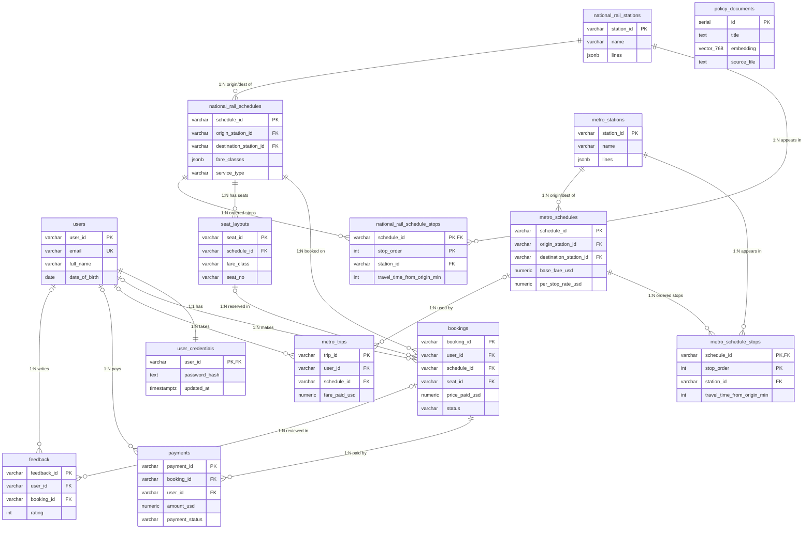

# TransitFlow 設計文件 — 第 45 組(中文版)

**組員:** 郭明儒(114423010,隊長)· 卓少筠(113403005)· 林楷崋(113403018)

> 本文件為 `Team45_DESIGN_DOC.md` 的中文對照版;正式繳交以英文版為準。

## Section 1 — Entity-Relationship Diagram(實體關係圖)



本圖採用 crow's-foot(鳥足)標記法,**基數(cardinality)直接以線上兩端的符號表示**:`||` 代表「恰好一個」、`o{` 代表「零或多個」、`|o` 代表「零或一個」。凡是子表外鍵可為 NULL 且採 `ON DELETE SET NULL` 之處,就會出現 `|o`(可選的一):例如 `users |o--o{ bookings` 表示一筆訂票*可以*關聯到一位使用者,但該使用者被刪除時 `bookings.user_id` 會被設為 `NULL`,讓財務/稽核紀錄得以保留。相對地,`national_rail_schedules ||--o{ bookings` 是強制的一(訂票必須指向真實存在的班表,由 `ON DELETE RESTRICT` 強制),而 `users ||--|| user_credentials` 是嚴格的 1:1,因為憑證直接以使用者的主鍵作為自己的主鍵,並隨使用者一併串聯刪除(CASCADE)。

`policy_documents` 刻意不與任何實體建立關係:它是檢索增強生成(RAG)的向量儲存庫,存放政策文字與 `vector(768)` 嵌入向量,只透過相似度搜尋存取——它永遠不會與營運資料表 JOIN,加外鍵毫無意義。班表與停靠站之間在概念上的多對多關係(「一個班表行經多個車站;一個車站出現在多個班表」)由兩個關聯實體 `metro_schedule_stops` 與 `national_rail_schedule_stops` 拆解。每個關聯實體攜帶這段關係自身的屬性——`stop_order`(從 0 起算的停靠順序)與 `travel_time_from_origin_min`——並使用複合主鍵 `(schedule_id, stop_order)`,正是教科書上「帶屬性的 M:N 關係拆解為 junction table」的標準作法。

## Section 2 — Normalisation Justification(正規化理由)

### 2.1 班表停靠站:junction table(3NF 決策)

舊設計把停靠站順序直接以 `stops_in_order` JSONB 陣列存在班表列裡,並用平行的 `travel_time_from_origin_min` JSONB 陣列為每站存一個行駛時間。具體缺陷如下:

- **違反 1NF(非原子欄位)。** 單一欄位裝了一串停靠站,元素的「位置」本身帶有意義——這正是 1NF 禁止的重複群組(repeating group)反模式。
- **隱藏的更新異常。** 停靠站陣列與行駛時間陣列是兩個獨立清單,必須靠人工保持索引對齊。插入一個停靠站要同步改兩個欄位;資料庫完全無法阻止兩者失去同步。
- **沒有參照完整性。** 停靠站只是 JSON 裡的字串,資料庫無法保證它對應真實車站——打錯字成 `"NR99"` 也會被默默接受。
- **查詢形狀差。** 「這個班表有沒有從 A 到 B 的服務?要多久?」必須掃描每個班表、在 Python 解析 JSON、再用陣列位置找兩個車站——全表掃描加應用端邏輯,任何索引都幫不上忙。

新設計抽出關聯表 `metro_schedule_stops(schedule_id, station_id, stop_order, travel_time_from_origin_min)`(以及國鐵版 `national_rail_schedule_stops`),符合 3NF:

- **複合主鍵 `(schedule_id, stop_order)`。** 每個非鍵屬性(`station_id`、`travel_time_from_origin_min`)都函數依賴(functionally dependent)於*整個*鍵、且只依賴於鍵——不存在部分依賴(滿足 2NF),也不存在透過非鍵屬性的遞移依賴(滿足 3NF)。
- **`UNIQUE (schedule_id, station_id)`** 禁止同一班表重複列出同一車站。這組欄位其實是此關聯的第二個*候選鍵(candidate key)*——兩組複合鍵都可以當主鍵;我們選 `(schedule_id, stop_order)` 作主鍵,因為「依序走訪」是最主要的存取模式,另一個候選鍵則用 UNIQUE 約束來強制。
- **帶刻意刪除規則的外鍵:** `schedule_id` 參照班表並設 `ON DELETE CASCADE`(停靠站脫離班表即無意義),`station_id` 參照車站表並設 `ON DELETE RESTRICT`(仍在路線上的車站不可被默默移除)。`station_id` 上的輔助索引支援反向查詢。

改變直接反映在查詢形狀上。起訖站之間的可訂性查詢,現在是 junction table 上一個集合式的自我 JOIN,順序由 `stop_order` 強制:

```sql
-- 節錄自 queries.py 的可訂性 / 票價查詢
JOIN national_rail_schedule_stops o ON o.schedule_id = s.schedule_id
JOIN national_rail_schedule_stops d ON d.schedule_id = s.schedule_id
WHERE o.station_id = %s
  AND d.station_id = %s
  AND o.stop_order < d.stop_order;   -- 目的站必須在起點站之後
```

這是索引可加速的宣告式查詢;票價計算所需的中途站數就是 `d.stop_order - o.stop_order`,Python 端完全不必解析 JSON。

### 2.2 密碼儲存

帳號憑證存放於 `user_credentials.password_hash`,透過 `argon2-cffi` 函式庫(`PasswordHasher`)以 **Argon2id** 雜湊。

- **為什麼不用 MD5 或 SHA-1。** 它們是為了「快速雜湊大量資料」設計的*快速通用*摘要演算法。對密碼而言,快就是致命傷:一般消費級 GPU 每秒可計算數十億次 MD5/SHA-1,外洩的雜湊表遭離線暴力破解或字典攻擊的成本極低。SHA-1 更已有實際示範過的碰撞攻擊(2017 年的 SHAttered),且兩者皆不內建鹽值或任何刻意的計算成本。
- **為什麼用 Argon2id。** Argon2id 是*記憶體困難(memory-hard)的金鑰衍生函數*,具備三個可獨立調整的成本參數——時間成本(迭代次數)、記憶體成本(使用的 KiB)與平行度。讓每一次猜測同時消耗大量記憶體與 CPU,徹底破壞 GPU/ASIC 破解的經濟效益——攻擊者再也無法用便宜晶片換取吞吐量。這種刻意的緩慢(key stretching,金鑰延展)是特性,不是缺陷。
- **鹽值(salt)。** `argon2-cffi` 為每組密碼產生隨機鹽值,並嵌入自我描述的編碼雜湊字串中。兩位使用相同密碼的使用者會得到不同的儲存雜湊,使預先計算的彩虹表(rainbow table)完全失效。
- **單一事實來源。** Seeder 與執行期驗證路徑(`login_user` → `_verify_password`)使用*同一個* `PasswordHasher` 實例/設定,確保雜湊的產生與驗證一致。`_verify_password` 同時回傳 `check_needs_rehash` 的結果,讓系統能在使用者下次登入時,以升級後的參數透明地重新雜湊密碼。

### 2.3 刻意保留的反正規化

四個 JSONB 欄位是刻意保留的:班表上的 `fare_classes` 與 `operates_on`、車站表上的 `lines`、`national_rail_schedules` 上的 `passed_through_stations`。理由是具體的,不是「JSON 比較方便」:

- 它們是**唯讀的顯示/設定屬性**——艙等標籤、營運日、路線標記——只用於 UI 呈現或過濾,從不逐項更新。
- 它們**從不作為 JOIN 鍵**,也**不需要參照完整性約束**,拆成 junction table 得不到任何好處。
- 拆解它們會多出三到四張表(與 JOIN),查詢效益卻是*零*。

全文件貫徹的規則很簡單:凡參與 JOIN 或約束的資料一律完全正規化;只會整塊讀回的資料允許留作 JSONB 文件(需要過濾之處仍以 GIN 索引支援)。

## Section 3 — Graph Database Design Rationale(圖資料庫設計理由)

**節點、關係與屬性。** 路網拓撲建模在 Neo4j。**節點**是 `Station`,並加掛 `MetroStation` 或 `NationalRailStation` 標籤,讓兩個子路網能各自獨立查詢。節點身分是業務鍵 `station_id`,由 `CREATE CONSTRAINT station_id_unique IF NOT EXISTS` 強制唯一(此唯一性約束同時建立支援索引)。**關係**是車站之間的有向邊:`METRO_LINK` 與 `RAIL_LINK` 建模同網內的相鄰關係(以成對方向播種),`INTERCHANGE_TO` 建模跨網轉乘,*雙向*各播種一條,`travel_time_min = 5`、票價 `0.0`(捷運與國鐵月台間轉乘免費)。邊上的**屬性**承載路徑權重:`travel_time_min`(整數)、`fare_standard`、`fare_first`。國鐵邊上 `fare_standard = travel_time_min * 0.35`、`fare_first = travel_time_min * 0.60`;捷運邊為均一票價。

**為什麼這類工作負載用圖資料庫勝過關聯式。** 路線規劃是相鄰關係上的*遞移閉包(transitive closure)*問題——「從 A 找一條長度未知的路徑到 B」——正是關聯代數最不擅長的。在 PostgreSQL 裡唯一的原生工具是 `WITH RECURSIVE` CTE,應用端被迫:自帶 visited 路徑陣列手動避免環路、施加任意的深度上限,並承擔隨遞迴層數成長的 JOIN 成本——而且*沒有*原生的權重優先展開(你無法叫遞迴先探索最便宜的邊界)。Neo4j 則把相鄰關係存成節點對節點的直接指標(index-free adjacency,無索引相鄰),走訪成本取決於*答案*的大小而非資料表的大小。一次 `apoc.algo.dijkstra(start, end, 'METRO_LINK>|RAIL_LINK>|INTERCHANGE_TO>', 'travel_time_min')` 呼叫,即以正確的演算法(Dijkstra)代勞優先佇列運算,回傳加權最短路徑。

**實例一 — 最短路徑。** `query_shortest_route` 的實際 Cypher(節錄):

```cypher
MATCH (start:Station {station_id: $origin_id})
MATCH (end:Station   {station_id: $destination_id})
CALL apoc.algo.dijkstra(
    start, end,
    'METRO_LINK>|RAIL_LINK>|INTERCHANGE_TO>',
    'travel_time_min'
) YIELD path, weight
RETURN weight AS total_time,
       [n IN nodes(path)         | n.station_id] AS stations,
       [r IN relationships(path) | r.travel_time_min] AS legs;
```

關聯式的等價寫法必須徒手重造走訪邏輯:

```sql
WITH RECURSIVE route(curr, dest, total_min, path, depth) AS (
    SELECT origin_id, origin_id, 0, ARRAY[origin_id], 0
    UNION ALL
    SELECT e.to_station, r.dest, r.total_min + e.travel_time_min,
           r.path || e.to_station, r.depth + 1
    FROM route r
    JOIN station_edges e ON e.from_station = r.curr
    WHERE e.to_station <> ALL(r.path)   -- 手動避免環路
      AND r.depth < 12                  -- 任意的深度上限
)
SELECT path, total_min FROM route
WHERE curr = $destination_id
ORDER BY total_min LIMIT 1;            -- 列舉完所有路徑後才挑「最短」
```

注意遞迴 CTE 是先列舉*所有*簡單路徑、最後才取最小值——沒有優先驅動的提早終止,做的工作嚴格多於 Dijkstra。

**實例二 — 延誤漣漪。** 「延誤車站 N 跳以內有哪些車站?各距離多遠?」用變長模式加跳數簿記(出自 `query_delay_ripple`):

```cypher
MATCH p = (start:Station {station_id: $station_id})
          -[:METRO_LINK|RAIL_LINK|INTERCHANGE_TO*1..N]-(affected:Station)
WITH affected, min(length(p)) AS hops_away
RETURN affected.station_id, hops_away
ORDER BY hops_away ASC;
```

當一個車站可由多條路徑抵達時,`min(length(p))` 保留最短距離。換成 SQL 又是一個迭代 CTE(或 N 層自我 JOIN),必須手動為每個車站追蹤並 `MIN` 跳數。

**艙等路徑計算。** 最便宜路徑查詢(`query_cheapest_route`)重用同一個 Dijkstra 呼叫,但從小型白名單置換*權重屬性*:`weight_property = "fare_first" if fare_class == "first" else "fare_standard"`。由於國鐵頭等艙每分鐘費率較高(`0.60` 對 `0.35`),同一張拓撲上,頭等艙請求可能算出不同的總價——有時甚至不同的路徑。白名單機制正是讓屬性置換免於注入風險的關鍵。

## Section 4 — Vector / RAG Design(向量 / RAG 設計)

**嵌入什麼、為什麼用餘弦相似度。** 13 份政策文件(退款政策、票種、訂票規則、旅運政策)之所以被嵌入,是因為它們是助理必須準確引用的自由文字知識——不像班表或票價,無法從關聯式資料列回答。餘弦相似度是這種搜尋的正確度量,因為它*與向量長度無關(magnitude-independent)*:只比較兩向量的**方向**(`cos θ = A·B / |A||B|`),不比長度。嵌入向量的長度會隨文件長度與詞元統計變動,因此同一主題的兩段文字——一行使用者問題與一整段政策條文——只要向量方向一致仍會得到高相似度。換成對長度敏感的度量(如原始歐氏距離),短查詢對上長文件會被系統性地懲罰。

**RAG 流程(編號)。**

1. 使用者訊息由設定的供應商(`llm_provider.py`)轉為嵌入向量。
2. `query_policy_vector_search` 以 pgvector 對 `policy_documents` 執行餘弦相似度搜尋——以 `1 - (embedding <=> %s::vector)` 作為相似度分數,由 HNSW 餘弦索引(`idx_policy_documents_embedding`)加速。保留高於 `VECTOR_SIMILARITY_THRESHOLD`(0.5)的資料列,回傳前 `VECTOR_TOP_K = 3` 名。
3. 取回的政策片段注入 system prompt 作為依據脈絡。
4. LLM 依該脈絡作答,因此回覆有真實政策文字為據,而非模型的參數記憶。
5. 同一個 agent 還能呼叫 SQL 與圖查詢工具,單一回答可同時結合檢索到的政策文字與即時的資料庫事實。

**嵌入維度。**

| 供應商 | 模型 | 維度 |
|--------|------|------|
| Ollama | nomic-embed-text | 768 |
| Gemini | gemini-embedding-001 | 3072 |

Schema 欄位為 `vector(768)`,對應預設的 Ollama 供應商。

**維度不匹配風險(必寫)。** 嵌入以 768 維播種,儲存的向量與 HNSW 索引都*綁定*在 768 維。若供應商切換為 Gemini,每個查詢向量都會是 3072 維;pgvector 在以 3072 維查詢向量比對 768 維欄位時會直接拋出維度不匹配錯誤——搜尋根本無法執行。因此換供應商不是改個設定而已:必須 `ALTER` 欄位型別至新維度、刪除並重建 HNSW 索引,*並且*把每份文件從頭重新嵌入。我們的緩解作法是用 `LLM_PROVIDER` 環境變數固定單一供應商,確保播種與查詢永遠一致。

## Section 5 — AI Tool Usage Evidence(AI 工具使用紀錄)

以下案例取自專案開發紀錄;每一例都展示 AI 輸出是被*驗證*而非被盲信的。

| # | Context(情境) | Prompt(提問摘要) | Outcome(結果) |
|---|----------------|--------------------|------------------|
| 1 | 在 Neo4j 實作捷運↔國鐵轉乘關係 | 「為捷運與國鐵路網之間的轉乘設計圖 schema」 | **AI 答錯:** 助理把關係命名為 `INTERCHANGES_WITH`,但作業規格要求 `INTERCHANGE_TO`。在對照評分指南時發現;於 seeder 與所有圖查詢中全面改名,並新增模擬檢查,斷言不得殘留任何舊關係名稱。 |
| 2 | 合併密碼安全分支 | 「把密碼雜湊/驗證重構成共用 helper」 | **AI 答錯:** 合併後 `_hash_password` / `_verify_password` 被引用 5 次卻無任何定義,`contextmanager` 匯入也遺失——登入/註冊一執行就 NameError。以全 repo grep 診斷後,用與 seeder 相同的 PasswordHasher 設定以 Argon2id 重新實作兩個 helper。 |
| 3 | 設計班表停靠站的儲存方式 | 「設計儲存各班表停靠站順序的 schema」 | **AI 答錯:** 初版設計把停靠站存成 JSONB 陣列,而評分指南明文禁止。重建為 junction table(0 起算的 stop_order、複合主鍵、外鍵),並改寫 seeder 與五個查詢函式改以 JOIN 取得。 |
| 4 | 撰寫延誤漣漪查詢 | 「寫一個 Cypher 查詢,回傳延誤車站 N 跳以內的所有車站」 | **AI 答錯:** 它把變長路徑上限參數化(`*1..$hops`),但 Cypher 不支援——執行即語法錯誤。改為經鉗制的整數內插(`max(1, min(int(hops), 10))`)並註解說明原因。 |

## Section 6 — Reflection & Trade-offs(反思與取捨)

1. **自然 VARCHAR 鍵 vs UUID/SERIAL。** 我們選擇人類可讀的業務鍵(`MS01`、`NR_SCH01`、`BK-XXXXXX`),因為 mock 資料集自帶穩定且跨檔交叉引用的識別碼,可讀的鍵也讓評分時的查詢輸出容易檢視。代價是自然鍵可猜測、可枚舉。在 production 我們會把營運資料表改為不透明的 UUID,以防止枚舉攻擊與跨資料來源的 ID 碰撞風險。

2. **班表停靠站:junction table vs JSONB。** 正規化停靠站帶來參照完整性與索引可加速的順序查詢(`stop_order` 自我 JOIN),代價是播種較複雜、重組完整路線時多一個 JOIN。我們接受這個取捨,因為在這裡正確性與查詢能力比播種簡單更重要。

3. **車站雙儲存(Postgres + Neo4j)。** PostgreSQL 是交易資料(訂票、付款、憑證)的權威紀錄;Neo4j 只存路徑計算用的拓撲。代價是兩套 seeder 必須保持同步——一邊新增的車站必須同時出現在另一邊。在 production 我們會指定 Postgres 為單一事實來源,改以變更資料擷取(CDC)派生圖資料,而非平行的 seeder。

4. **Production 強化清單。** 此專案若要上線,我們會補上:參數化的連線池;以 Alembic 或 Flyway 等工具管理 schema migration,而非重建 Docker volume;以 vault 管理機密,而非提交 `.env`;HNSW 參數調校與明確的嵌入維度治理;以及監控交易重試/回滾比率以及早發現競爭。

## Section 7 — Bonus Extension Motivation, Changes, Example Queries, and Testing Evidence(加分擴充:動機、變更、範例查詢與測試證據)

### 7.1 動機

本加分擴充在關聯式資料庫層新增資料庫分析工具,目標是在既有的訂票與班表查詢之外提供有意義的營運洞察,使本擴充符合資料庫類加分的完整資格。

本擴充刻意以資料庫為核心,因為資料庫類擴充可獲得完整的 +15 分。它新增一個彙總訂票活動、營收與退款總額的查詢,為分析儀表板或營運報表介面提供實用的新能力。

### 7.2 變更內容

**資料庫層:**
- 新增 `query_booking_revenue_summary(start_date: Optional[str] = None, end_date: Optional[str] = None) -> dict`
  - 回傳營運指標:訂票總數、有效/取消數、營收、退款
  - 查詢 `bookings` 表,支援選擇性日期區間過濾

- 新增 `query_trip_history(user_email: str, limit: int = 20) -> dict`
  - 回傳使用者完整的旅程歷史細節
  - 查詢 `bookings` JOIN `national_rail_schedules`
  - 包含車站名稱、日期、票價、退款狀態與訂票編號

- 新增 `query_route_visualization(origin_station: str, destination_station: str, route_type: str) -> dict`
  - 回傳路線規劃用的詳細路線資訊
  - 查詢 `national_rail_schedules` 或 `metro_schedules` 及其停靠站細節
  - 包含停靠順序、行駛時間與艙等票價

**UI 層:**
- 側欄新增分析儀表板面板:
  - 日期區間輸入與重新整理按鈕
  - 顯示總訂票/有效/取消數、營收與退款

- 側欄新增旅程歷史面板:
  - 「載入我的旅程歷史」按鈕(僅登入後可用)
  - 以 Markdown 表格顯示使用者旅程,欄位包含:
    - 訂票編號、起點、迄點、日期、艙等、金額、狀態
  - 呈現聊天介面無法展示的個人旅程資料

- 側欄新增路線視覺化面板:
  - 起點與迄點車站 ID 輸入
  - 路線類型下拉選單(national_rail 或 metro)
  - 「Visualize Route」按鈕
  - 顯示的路線資訊包含:
    - 路線編號、服務類型、方向、班表 ID
    - 首末班車時間與班距
    - 全部停靠站及自起點的行駛時間
    - 各艙等票價細節

- 新增 `render_trip_history(user_email: str) -> str`
  - 將旅程歷史格式化為 Markdown 表格顯示

- 新增 `render_route_visualization(origin: str, destination: str, route_type: str) -> str`
  - 將路線細節格式化為具視覺層次的 Markdown 顯示

- 新增文件:
  - `TASK6.md` 列出加分要求的所有修改檔案與函式。
  - `Team45_DESIGN_DOC.md` 內含 Section 7,涵蓋動機、變更、範例查詢與測試證據。

### 7.3 範例查詢

**分析(營運):**
- `query_booking_revenue_summary()`
  - 回傳所有日期的整體訂票營收指標。
- `query_booking_revenue_summary(start_date='2026-04-01', end_date='2026-04-30')`
  - 回傳 2026 年 4 月的訂票與營收彙總指標。

**旅程歷史(個人):**
- `query_trip_history(user_email='alice@example.com')`
  - 回傳 Alice 最近 10 筆旅程的完整細節(訂票編號、路線、日期、票價、狀態)
- `query_trip_history(user_email='bob@example.com', limit=5)`
  - 回傳 Bob 最近 5 筆旅程

**路線視覺化(路線規劃):**
- `query_route_visualization('NR01', 'NR05', 'national_rail')`
  - 回傳 NR01 與 NR05 之間所有國鐵路線
  - 依序顯示停靠站、行駛時間與艙等
- `query_route_visualization('MS01', 'MS10', 'metro')`
  - 回傳 MS01 與 MS10 之間所有捷運路線

回傳資料可直接供儀表板使用,或由 AI agent 用於回答下列問題:

**營運類問題:**
- 「上個月國鐵訂票帶來多少營收?」
- 「四月取消訂票的退款總額是多少?」
- 「系統今天有多少有效訂票?」

**個人類問題(登入後):**
- 「顯示我最近的旅程」
- 「我上一次訂票是什麼時候?」
- 「我在國鐵訂票上花了多少錢?」

**路線規劃類問題:**
- 「NR01 到 NR05 有哪些路線?」
- 「顯示前往 MS10 的捷運路線」
- 「NR01–NR05 路線有哪些艙等?」

### 7.4 測試證據

開發期間執行的驗證步驟:

1. 確認新函式語法正確,並已整合進既有的關聯式查詢模組。
2. 驗證 `databases/relational/queries.py` 檔案頂部附近含有必要的 `# TASK 6 EXTENSION:` 標記。
3. 確認新函式能以現行 PostgreSQL schema 對既有 `bookings` 表執行,並回傳正確的彙總指標。
4. 新增 repo 根目錄的 `TASK6.md`,滿足加分要求的檔案清單與修改追蹤。

新查詢刻意保持簡單並與現行 schema 相容,在新增有意義的資料庫能力之餘將風險降到最低。
