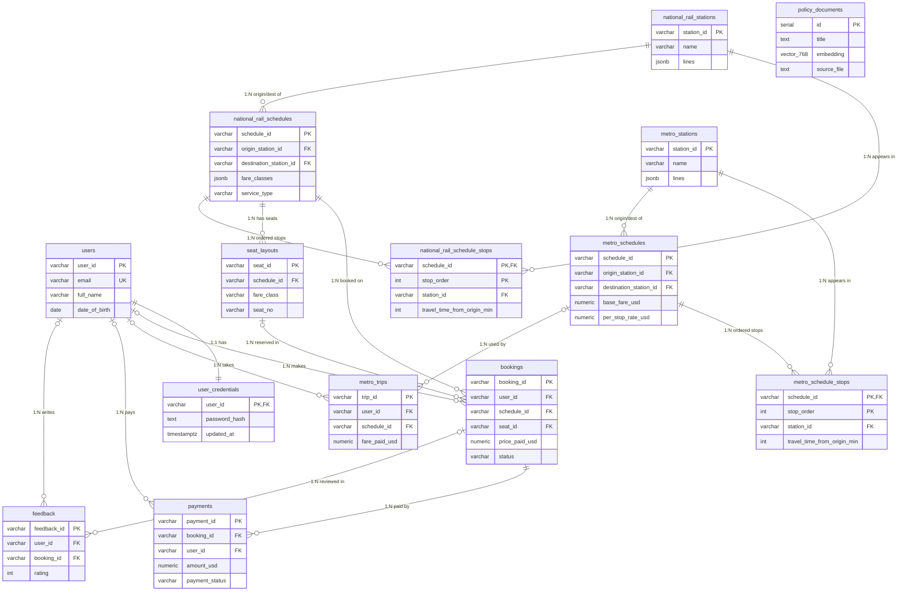

# work.txt 評分要求補完 Implementation Plan

> **For agentic workers:** REQUIRED SUB-SKILL: Use superpowers:subagent-driven-development (recommended) or superpowers:executing-plans to implement this plan task-by-task. Steps use checkbox (`- [ ]`) syntax for tracking.

**Goal:** 修復 TransitFlow 專案與評分指南 (work.txt) 的全部落差:runtime crash bugs、Neo4j 關係命名、junction table 重構、缺失的 payments transaction、設計文件 Section 1~6 與分工報告模板,並以模擬 Live Testing 驗證。

**Architecture:** PostgreSQL (pgvector) + Neo4j + Python (psycopg2 / neo4j-driver),Gradio UI。Schema 由 docker-entrypoint-initdb 載入,seed 腳本冪等 (`ON CONFLICT DO NOTHING` / `MERGE`)。本計畫不引入新依賴;驗證用自寫腳本 `scripts/live_test_simulation.py`。

**Tech Stack:** Python 3.x, psycopg2-binary, argon2-cffi, neo4j-driver 5.x, Docker Compose (postgres:pg16-pgvector port 5433, neo4j:5-community bolt port 7688, APOC enabled)。

**Spec:** `docs/superpowers/specs/2026-06-06-worktxt-remediation-design.md`

**重要環境事實:**
- docker-compose 將 Postgres 映射到 host **5433**、Neo4j bolt 映射到 **7688**;`skeleton/config.py` 預設值是 5432/7687,實際連線參數來自 `.env`(gitignored)。執行任何 DB 操作前必須確認 `.env` 的 `PG_PORT=5433`、`NEO4J_URI=bolt://localhost:7688`。
- `schema.sql` 只在 Postgres volume 初始化時執行 — schema 改動後必須 `docker compose down -v` 重建。
- `seed_neo4j.py:199` 開頭就 `MATCH (n) DETACH DELETE n`,所以 Neo4j 關係改名不需要額外遷移。
- `skeleton/agent.py:401` 用 `json.dumps(result, default=str)` 序列化工具結果,query 回傳 dict 安全。
- 專案沒有測試框架;驗證一律用 `python -m py_compile`、`python -c` 匯入檢查,以及最後的 live simulation 腳本。所有 python 指令在 repo 根目錄執行(模組以 `skeleton.config` 形式匯入)。

---

## File Structure

| 檔案 | 動作 | 職責 |
|------|------|------|
| `databases/relational/queries.py` | Modify | 修 import / hash 函式 / contextmanager / junction 查詢 / bookings dict / payment transaction |
| `databases/relational/schema.sql` | Modify | 車站表、junction tables、移除 stops JSONB、TIMESTAMPTZ、PK 註解、新 FK |
| `skeleton/seed_postgres.py` | Modify | 車站 seed、junction stops seed、移除 stops JSONB 欄位 |
| `skeleton/seed_neo4j.py` | Modify | METRO_LINK / RAIL_LINK / INTERCHANGE_TO、fare_standard / fare_first 屬性 |
| `databases/graph/queries.py` | Modify | 關係名稱、cheapest fare_class、delay_ripple hops 修正 |
| `skeleton/agent.py` | Modify | `stops_in_order` 改用 `stops_travelled`(get_metro_fare 工具) |
| `scripts/live_test_simulation.py` | Create | 模擬 Live Testing A/B/C 全部測項,輸出 PASS/FAIL |
| `TeamXX_DESIGN_DOC.md` | Create (git mv 自 `DESIGN_DOCUMENT.md`) | Section 1~7 設計文件 |
| `TeamXX_WORK_ALLOCATION.md` | Create | 分工報告模板(占位符) |
| `SUBMISSION_CHECKLIST.md` | Create | 團隊手動操作清單(repo 改名、public、檔名替換) |

---

### Task 1: 修復 queries.py 的 crash bugs(import、hash 函式、get_db_connection)

**Files:**
- Modify: `databases/relational/queries.py`(imports 區、`get_db_connection`、新增兩個 hash 函式)

- [ ] **Step 1: 補 imports**

在 `databases/relational/queries.py` 第 20~32 行的 import 區塊,將:

```python
from __future__ import annotations

import json
import random
import string
from datetime import datetime, timezone
from typing import Optional
```

改為:

```python
from __future__ import annotations

import json
import random
import string
from contextlib import contextmanager
from datetime import datetime, timezone
from typing import Optional

from argon2 import PasswordHasher
from argon2 import exceptions as argon2_exceptions
```

- [ ] **Step 2: 重寫 get_db_connection(目前是假的 contextmanager,執行必崩)**

將第 61~70 行:

```python
@contextmanager
def get_db_connection():
    """Optimization 2: Safe connection borrow/return mechanism (Context Manager).
    Replaces the previous `_connect()` function which created a new connection
    on every call.
    """
    pool_instance = _get_pool()
    conn = pool_instance.getconn()
    conn.autocommit = True
    return conn
```

改為:

```python
@contextmanager
def get_db_connection():
    """Borrow a pooled connection as a context manager.

    One `with` block = one transaction:
    - commits on normal exit (so multi-statement writes such as
      booking + payment are persisted atomically),
    - rolls back and re-raises on any exception,
    - always returns the connection to the pool.
    """
    pool_instance = _get_pool()
    conn = pool_instance.getconn()
    try:
        yield conn
        conn.commit()
    except Exception:
        conn.rollback()
        raise
    finally:
        pool_instance.putconn(conn)
```

注意:原版 `return conn` 在 `@contextmanager` 下不是 generator,`with get_db_connection()` 第一次執行就 TypeError;且 `autocommit=True` 違反 B9 的單一 transaction 要求。

- [ ] **Step 3: 新增密碼 hash 函式(緊接在 `_gen_payment_id` 之後、`_table_exists` 之前)**

```python
# ─────────────────────────────────────────────────────────────────────────────
# Password hashing (Argon2id — same hasher settings as skeleton/seed_postgres.py
# so seeded credentials verify correctly at login)
# ─────────────────────────────────────────────────────────────────────────────

_ph = PasswordHasher()


def _hash_password(plain_password: str) -> str:
    """Hash a plaintext password with Argon2id (memory-hard KDF, random salt)."""
    return _ph.hash(plain_password)


def _verify_password(stored_hash: str, plain_password: str) -> tuple[bool, bool]:
    """Verify a password against a stored Argon2 hash.

    Returns (is_valid, needs_rehash). Never raises: malformed or
    non-matching hashes simply yield (False, False).
    """
    try:
        _ph.verify(stored_hash, plain_password)
    except (
        argon2_exceptions.VerifyMismatchError,
        argon2_exceptions.VerificationError,
        argon2_exceptions.InvalidHashError,
    ):
        return False, False
    return True, _ph.check_needs_rehash(stored_hash)
```

- [ ] **Step 4: 順手修 `_ensure_user_auth_columns` 內的 TIMESTAMP(第 173、183~184 行)**

`CREATE TABLE IF NOT EXISTS users (...)` 內 `created_at TIMESTAMP DEFAULT CURRENT_TIMESTAMP` → `created_at TIMESTAMPTZ DEFAULT CURRENT_TIMESTAMP`;`user_credentials` 內兩個 `TIMESTAMP` 同樣改 `TIMESTAMPTZ`。

- [ ] **Step 5: 驗證編譯與匯入**

Run: `python -m py_compile databases/relational/queries.py; python -c "import databases.relational.queries as q; print(q._verify_password(q._hash_password('abc'), 'abc')); print(q._verify_password(q._hash_password('abc'), 'wrong'))"`
Expected: `(True, False)` 然後 `(False, False)`,無例外。

- [ ] **Step 6: Commit**

```bash
git add databases/relational/queries.py
git commit -m "fix: restore password hashing and repair broken get_db_connection contextmanager"
```

---

### Task 2: schema.sql — 車站表、junction tables、TIMESTAMPTZ、PK 註解

**Files:**
- Modify: `databases/relational/schema.sql`

- [ ] **Step 1: 在檔案開頭(`CREATE EXTENSION` 之後)加 PK / 刪除策略註解區塊**

```sql
-- ============================================================
-- Primary-key strategy
-- Most tables use natural VARCHAR business keys (e.g. 'MS01',
-- 'NR_SCH01', 'BK-XXXXXX') because the mock dataset ships with
-- stable, human-readable identifiers referenced across files;
-- reusing them avoids surrogate-key mapping during seeding and
-- keeps FK values readable in graded query output.
-- policy_documents uses SERIAL because RAG chunks have no
-- natural identifier and are only referenced internally.
--
-- Deletion strategy (consistent across all FKs):
--   * reference/parent data (stations, schedules, seats)
--       -> ON DELETE RESTRICT  (never silently lose journeys)
--   * dependent detail rows (credentials, schedule stops, payments)
--       -> ON DELETE CASCADE   (meaningless without their parent)
--   * optional audit links (bookings.user_id, feedback.*)
--       -> ON DELETE SET NULL  (keep the financial/audit record)
-- ============================================================
```

- [ ] **Step 2: policy_documents 的 TIMESTAMP → TIMESTAMPTZ(第 22 行)**

`created_at TIMESTAMP DEFAULT CURRENT_TIMESTAMP` → `created_at TIMESTAMPTZ DEFAULT CURRENT_TIMESTAMP`

- [ ] **Step 3: 在 policy_documents 區塊之後、metro_schedules 之前,新增兩張車站表**

```sql
-- ============================================================
-- 1b. Stations
-- Parents for schedule stops, schedules, bookings and trips.
-- Mirrors train-mock-data/metro_stations.json and
-- national_rail_stations.json (adjacency lives in Neo4j).
-- ============================================================

CREATE TABLE IF NOT EXISTS metro_stations (
    station_id VARCHAR(20) PRIMARY KEY,   -- natural key, e.g. 'MS01'
    name VARCHAR(100) NOT NULL,

    -- e.g. ["M1", "M2"]; kept as JSONB because lines are a small,
    -- read-only display attribute (graph routing lives in Neo4j)
    lines JSONB,

    is_interchange_metro BOOLEAN DEFAULT FALSE,
    is_interchange_national_rail BOOLEAN DEFAULT FALSE,
    interchange_national_rail_station_id VARCHAR(20),

    created_at TIMESTAMPTZ DEFAULT CURRENT_TIMESTAMP
);

CREATE TABLE IF NOT EXISTS national_rail_stations (
    station_id VARCHAR(20) PRIMARY KEY,   -- natural key, e.g. 'NR01'
    name VARCHAR(100) NOT NULL,

    lines JSONB,

    is_interchange_national_rail BOOLEAN DEFAULT FALSE,
    is_interchange_metro BOOLEAN DEFAULT FALSE,
    interchange_metro_station_id VARCHAR(20),

    created_at TIMESTAMPTZ DEFAULT CURRENT_TIMESTAMP
);
```

- [ ] **Step 4: metro_schedules — 移除 JSONB stops 欄位、加 FK、TIMESTAMPTZ**

從 `metro_schedules` 刪除這兩個欄位(含註解):
- `stops_in_order JSONB NOT NULL,`(第 47~48 行)
- `travel_time_from_origin_min JSONB,`(第 53~54 行)

`created_at TIMESTAMP ...` → `TIMESTAMPTZ`。表尾(`created_at` 之後)加:

```sql
    CONSTRAINT fk_metro_schedules_origin
        FOREIGN KEY (origin_station_id)
        REFERENCES metro_stations(station_id)
        ON DELETE RESTRICT,

    CONSTRAINT fk_metro_schedules_destination
        FOREIGN KEY (destination_station_id)
        REFERENCES metro_stations(station_id)
        ON DELETE RESTRICT
```

緊接在 metro_schedules 的三個既有 index 之後新增 junction table:

```sql
-- ============================================================
-- 2b. Metro schedule stops (junction table)
-- Replaces the former stops_in_order / travel_time_from_origin_min
-- JSONB columns: one row per (schedule, station) with an explicit
-- 0-based stop_order. This is the 3NF decomposition required for
-- ordered many-to-many schedule->station data.
-- ============================================================

CREATE TABLE IF NOT EXISTS metro_schedule_stops (
    schedule_id VARCHAR(30) NOT NULL,
    station_id VARCHAR(20) NOT NULL,

    stop_order INT NOT NULL,                          -- 0 = origin
    travel_time_from_origin_min INT NOT NULL DEFAULT 0,

    PRIMARY KEY (schedule_id, stop_order),
    UNIQUE (schedule_id, station_id),

    CONSTRAINT fk_metro_schedule_stops_schedule
        FOREIGN KEY (schedule_id)
        REFERENCES metro_schedules(schedule_id)
        ON DELETE CASCADE,

    CONSTRAINT fk_metro_schedule_stops_station
        FOREIGN KEY (station_id)
        REFERENCES metro_stations(station_id)
        ON DELETE RESTRICT
);

CREATE INDEX IF NOT EXISTS idx_metro_schedule_stops_station
ON metro_schedule_stops (station_id);
```

- [ ] **Step 5: national_rail_schedules — 同樣處理**

刪除 `stops_in_order JSONB NOT NULL,`(第 92~93 行)與 `travel_time_from_origin_min JSONB,`(第 101~102 行)。`passed_through_stations`、`fare_classes`、`operates_on` JSONB **保留**。`created_at TIMESTAMP` → `TIMESTAMPTZ`。表尾加:

```sql
    CONSTRAINT fk_national_rail_schedules_origin
        FOREIGN KEY (origin_station_id)
        REFERENCES national_rail_stations(station_id)
        ON DELETE RESTRICT,

    CONSTRAINT fk_national_rail_schedules_destination
        FOREIGN KEY (destination_station_id)
        REFERENCES national_rail_stations(station_id)
        ON DELETE RESTRICT
```

其 index 之後新增:

```sql
-- ============================================================
-- 3b. National rail schedule stops (junction table)
-- Same 3NF decomposition as metro_schedule_stops.
-- ============================================================

CREATE TABLE IF NOT EXISTS national_rail_schedule_stops (
    schedule_id VARCHAR(30) NOT NULL,
    station_id VARCHAR(20) NOT NULL,

    stop_order INT NOT NULL,                          -- 0 = origin
    travel_time_from_origin_min INT NOT NULL DEFAULT 0,

    PRIMARY KEY (schedule_id, stop_order),
    UNIQUE (schedule_id, station_id),

    CONSTRAINT fk_national_rail_schedule_stops_schedule
        FOREIGN KEY (schedule_id)
        REFERENCES national_rail_schedules(schedule_id)
        ON DELETE CASCADE,

    CONSTRAINT fk_national_rail_schedule_stops_station
        FOREIGN KEY (station_id)
        REFERENCES national_rail_stations(station_id)
        ON DELETE RESTRICT
);

CREATE INDEX IF NOT EXISTS idx_national_rail_schedule_stops_station
ON national_rail_schedule_stops (station_id);
```

- [ ] **Step 6: 全檔 TIMESTAMP → TIMESTAMPTZ**

剩餘所有 `TIMESTAMP DEFAULT CURRENT_TIMESTAMP` 和獨立的 `TIMESTAMP`(users.created_at、user_credentials×2、seat_layouts.created_at、bookings.booked_at/cancelled_at、metro_trips.created_at、payments.paid_at/created_at、feedback.created_at)全改 `TIMESTAMPTZ`。改完後 `TIMESTAMP `(不含 TZ)應為 0 處。

- [ ] **Step 7: 移除 stops 相關 GIN index(檔尾)**

刪除這四個(其餘 GIN index 保留):
- `idx_metro_schedules_stops_gin`
- `idx_metro_schedules_travel_time_gin`
- `idx_national_rail_schedules_stops_gin`
- `idx_national_rail_schedules_travel_time_gin`

- [ ] **Step 8: 驗證 schema 語法**

Run: `docker compose up -d postgres`(若未啟動)後
`docker exec -i transitflow_postgres_v2a psql -U transitflow -d postgres -c "CREATE DATABASE schema_lint;" ; Get-Content databases/relational/schema.sql -Raw | docker exec -i transitflow_postgres_v2a psql -U transitflow -d schema_lint -v ON_ERROR_STOP=1 -f - ; docker exec -i transitflow_postgres_v2a psql -U transitflow -d postgres -c "DROP DATABASE schema_lint;"`
Expected: 全部 CREATE 成功、exit 0、無 ERROR。

- [ ] **Step 9: Commit**

```bash
git add databases/relational/schema.sql
git commit -m "feat: add station tables and schedule-stops junction tables, use TIMESTAMPTZ"
```

---

### Task 3: seed_postgres.py — 車站 seed 與 junction stops seed

**Files:**
- Modify: `skeleton/seed_postgres.py`

- [ ] **Step 1: 改寫 seed_metro_stations(目前是 no-op)**

```python
def seed_metro_stations(cur):
    if not table_exists(cur, "metro_stations"):
        print("  metro_stations: table not found, skipped")
        return

    data = load("metro_stations.json")
    rows = []

    for item in data:
        rows.append(
            (
                item["station_id"],
                item.get("name", item["station_id"]),
                json_dumps(item.get("lines", [])),
                item.get("is_interchange_metro", False),
                item.get("is_interchange_national_rail", False),
                item.get("interchange_national_rail_station_id"),
            )
        )

    inserted = insert_many(
        cur,
        "metro_stations",
        [
            "station_id",
            "name",
            "lines",
            "is_interchange_metro",
            "is_interchange_national_rail",
            "interchange_national_rail_station_id",
        ],
        rows,
    )

    print(f"  metro_stations: {inserted} rows inserted / {len(rows)} prepared")
```

- [ ] **Step 2: 改寫 seed_national_rail_stations(同構)**

```python
def seed_national_rail_stations(cur):
    if not table_exists(cur, "national_rail_stations"):
        print("  national_rail_stations: table not found, skipped")
        return

    data = load("national_rail_stations.json")
    rows = []

    for item in data:
        rows.append(
            (
                item["station_id"],
                item.get("name", item["station_id"]),
                json_dumps(item.get("lines", [])),
                item.get("is_interchange_national_rail", False),
                item.get("is_interchange_metro", False),
                item.get("interchange_metro_station_id"),
            )
        )

    inserted = insert_many(
        cur,
        "national_rail_stations",
        [
            "station_id",
            "name",
            "lines",
            "is_interchange_national_rail",
            "is_interchange_metro",
            "interchange_metro_station_id",
        ],
        rows,
    )

    print(f"  national_rail_stations: {inserted} rows inserted / {len(rows)} prepared")
```

- [ ] **Step 3: 新增共用 junction-stops seeder(放在 seed_metro_schedules 之前)**

```python
def seed_schedule_stops(cur, stops_table: str, data: list[dict]):
    """
    Populate a schedule-stops junction table from the mock data's
    stops_in_order list + travel_time_from_origin_min map.
    stop_order is the 0-based position in stops_in_order.
    """
    if not table_exists(cur, stops_table):
        print(f"  {stops_table}: table not found, skipped")
        return

    rows = []

    for item in data:
        times = item.get("travel_time_from_origin_min") or {}
        for order, station_id in enumerate(item.get("stops_in_order", [])):
            rows.append(
                (
                    item["schedule_id"],
                    station_id,
                    order,
                    int(times.get(station_id, 0)),
                )
            )

    inserted = insert_many(
        cur,
        stops_table,
        ["schedule_id", "station_id", "stop_order", "travel_time_from_origin_min"],
        rows,
    )

    print(f"  {stops_table}: {inserted} rows inserted / {len(rows)} prepared")
```

- [ ] **Step 4: seed_metro_schedules — 移除 JSONB stops 欄位、串接 junction seed**

rows tuple 刪除 `json_dumps(item.get("stops_in_order", []))` 和 `json_dumps(item.get("travel_time_from_origin_min", {}))` 兩個元素;欄位清單刪除 `"stops_in_order"` 和 `"travel_time_from_origin_min"`。函式最後(print 之後)加:

```python
    seed_schedule_stops(cur, "metro_schedule_stops", data)
```

- [ ] **Step 5: seed_national_rail_schedules — 同樣處理**

刪除相同兩個 tuple 元素與欄位名(`passed_through_stations`、`fare_classes`、`operates_on` 保留)。函式最後加:

```python
    seed_schedule_stops(cur, "national_rail_schedule_stops", data)
```

- [ ] **Step 6: print_table_counts 的 tables 清單補上四張新表**

`"metro_stations", "national_rail_stations", "metro_schedule_stops", "national_rail_schedule_stops",` 插入清單開頭。

- [ ] **Step 7: 驗證編譯**

Run: `python -m py_compile skeleton/seed_postgres.py`
Expected: 無輸出,exit 0。(實際 seed 在 Task 8 跑,因為需要先重建 schema volume。)

- [ ] **Step 8: Commit**

```bash
git add skeleton/seed_postgres.py
git commit -m "feat: seed station tables and schedule-stops junction tables"
```

---

### Task 4: relational queries.py — junction 查詢重寫、bookings dict、payment transaction

**Files:**
- Modify: `databases/relational/queries.py`
- Modify: `skeleton/agent.py`(get_metro_fare 工具的 stops 計算)

- [ ] **Step 1: 重寫 query_national_rail_availability(B1)**

整個函式(原 291~386 行)替換為:

```python
def query_national_rail_availability(
    origin_id: str,
    destination_id: str,
    travel_date: Optional[str] = None,
) -> list[dict]:
    """
    Return national rail schedules serving origin before destination,
    resolved through the national_rail_schedule_stops junction table.
    Returns [] when nothing matches (never raises for missing data).
    """
    origin_id = origin_id.upper()
    destination_id = destination_id.upper()

    with get_db_connection() as conn:
        with conn.cursor(cursor_factory=psycopg2.extras.RealDictCursor) as cur:
            if not _table_exists(cur, "national_rail_schedules"):
                return []
            if not _table_exists(cur, "national_rail_schedule_stops"):
                return []

            # Self-join the junction table: the origin stop must appear
            # strictly before the destination stop on the same schedule.
            cur.execute(
                """
                SELECT
                    s.*,
                    o.stop_order AS origin_order,
                    o.travel_time_from_origin_min AS origin_time_min,
                    d.stop_order AS destination_order,
                    d.travel_time_from_origin_min AS destination_time_min
                FROM national_rail_schedules s
                JOIN national_rail_schedule_stops o
                    ON o.schedule_id = s.schedule_id
                   AND o.station_id = %s
                JOIN national_rail_schedule_stops d
                    ON d.schedule_id = s.schedule_id
                   AND d.station_id = %s
                WHERE o.stop_order < d.stop_order
                ORDER BY s.schedule_id
                """,
                (origin_id, destination_id),
            )
            schedules = [dict(row) for row in cur.fetchall()]

            results = []

            for sched in schedules:
                cur.execute(
                    """
                    SELECT station_id
                    FROM national_rail_schedule_stops
                    WHERE schedule_id = %s
                    ORDER BY stop_order
                    """,
                    (sched["schedule_id"],),
                )
                # stop_order is 0-based and contiguous (seeded via enumerate),
                # so list position == stop_order.
                all_stops = [r["station_id"] for r in cur.fetchall()]
                journey_stops = all_stops[
                    sched["origin_order"]: sched["destination_order"] + 1
                ]
                stops_travelled = sched["destination_order"] - sched["origin_order"]

                total_booked = 0
                standard_booked = 0
                first_booked = 0

                if travel_date and _table_exists(cur, "bookings"):
                    cur.execute(
                        """
                        SELECT
                            COUNT(*) AS total_booked,
                            SUM(CASE WHEN LOWER(COALESCE(fare_class, 'standard')) = 'standard' THEN 1 ELSE 0 END) AS standard_booked,
                            SUM(CASE WHEN LOWER(COALESCE(fare_class, 'standard')) = 'first' THEN 1 ELSE 0 END) AS first_booked
                        FROM bookings
                        WHERE schedule_id = %s
                          AND travel_date = %s
                          AND LOWER(COALESCE(status, 'active')) NOT IN ('cancelled', 'canceled')
                        """,
                        (sched["schedule_id"], travel_date),
                    )
                    booking_row = cur.fetchone()

                    if booking_row:
                        total_booked = booking_row["total_booked"] or 0
                        standard_booked = booking_row["standard_booked"] or 0
                        first_booked = booking_row["first_booked"] or 0

                duration = max(
                    _as_float(sched.get("destination_time_min"), 0.0)
                    - _as_float(sched.get("origin_time_min"), 0.0),
                    0.0,
                )

                results.append(
                    {
                        "schedule_id": sched.get("schedule_id"),
                        "line": sched.get("line"),
                        "service_type": sched.get("service_type", "national_rail"),
                        "origin_id": origin_id,
                        "destination_id": destination_id,
                        "first_train_time": str(sched.get("first_train_time")) if sched.get("first_train_time") else None,
                        "last_train_time": str(sched.get("last_train_time")) if sched.get("last_train_time") else None,
                        "frequency_min": sched.get("frequency_min"),
                        "stops_travelled": stops_travelled,
                        "stops_in_order": journey_stops,
                        "full_route": all_stops,
                        "estimated_duration_min": duration,
                        "travel_date": travel_date,
                        "seat_occupancy": {
                            "total_booked": total_booked,
                            "standard_booked": standard_booked,
                            "first_booked": first_booked,
                        },
                    }
                )

            return results
```

(注意:table 不存在時原本回 `[{"error": ...}]`,改回 `[]` 以符合「找不到資料回 []」原則。)

- [ ] **Step 2: 重寫 query_metro_schedules(B2)**

整個函式(原 453~507 行)替換為:

```python
def query_metro_schedules(origin_id: str, destination_id: str) -> list[dict]:
    """
    Return metro schedules serving origin before destination, resolved
    through the metro_schedule_stops junction table. Returns [] when
    nothing matches.
    """
    origin_id = origin_id.upper()
    destination_id = destination_id.upper()

    with get_db_connection() as conn:
        with conn.cursor(cursor_factory=psycopg2.extras.RealDictCursor) as cur:
            if not _table_exists(cur, "metro_schedules"):
                return []
            if not _table_exists(cur, "metro_schedule_stops"):
                return []

            cur.execute(
                """
                SELECT
                    s.*,
                    o.stop_order AS origin_order,
                    o.travel_time_from_origin_min AS origin_time_min,
                    d.stop_order AS destination_order,
                    d.travel_time_from_origin_min AS destination_time_min
                FROM metro_schedules s
                JOIN metro_schedule_stops o
                    ON o.schedule_id = s.schedule_id
                   AND o.station_id = %s
                JOIN metro_schedule_stops d
                    ON d.schedule_id = s.schedule_id
                   AND d.station_id = %s
                WHERE o.stop_order < d.stop_order
                ORDER BY s.schedule_id
                """,
                (origin_id, destination_id),
            )
            schedules = [dict(row) for row in cur.fetchall()]

            results = []

            for sched in schedules:
                cur.execute(
                    """
                    SELECT station_id
                    FROM metro_schedule_stops
                    WHERE schedule_id = %s
                    ORDER BY stop_order
                    """,
                    (sched["schedule_id"],),
                )
                all_stops = [r["station_id"] for r in cur.fetchall()]
                journey_stops = all_stops[
                    sched["origin_order"]: sched["destination_order"] + 1
                ]
                stops_travelled = sched["destination_order"] - sched["origin_order"]

                duration = max(
                    _as_float(sched.get("destination_time_min"), 0.0)
                    - _as_float(sched.get("origin_time_min"), 0.0),
                    0.0,
                )

                item = dict(sched)
                item.update(
                    {
                        "origin_id": origin_id,
                        "destination_id": destination_id,
                        "stops_travelled": stops_travelled,
                        "journey_stops": journey_stops,
                        "stops_in_order": all_stops,
                        "estimated_duration_min": duration,
                    }
                )
                results.append(item)

            return results
```

- [ ] **Step 3: query_route_visualization — stops_detail 改查 junction(原 788~827 行)**

SELECT 欄位清單移除 `stops_in_order,` 和 `travel_time_from_origin_min,`(metro 表沒有 fare_classes / service_type 欄位 — 注意原程式對 metro 也 SELECT 這兩欄,會錯;改成動態欄位):

將 `cur.execute(f""" SELECT ... FROM {table_name} ...""")` 起到 `routes.append(route_dict)` 止的迴圈整段改為:

```python
            stops_table = (
                "national_rail_schedule_stops"
                if route_type == "national_rail"
                else "metro_schedule_stops"
            )

            cur.execute(
                f"""
                SELECT *
                FROM {table_name}
                WHERE origin_station_id = %s AND destination_station_id = %s
                ORDER BY line
                """,
                (origin_station, destination_station),
            )

            routes = []
            for row in cur.fetchall():
                route_dict = dict(row)

                # Resolve ordered stops from the junction table.
                cur.execute(
                    f"""
                    SELECT station_id, stop_order, travel_time_from_origin_min
                    FROM {stops_table}
                    WHERE schedule_id = %s
                    ORDER BY stop_order
                    """,
                    (route_dict["schedule_id"],),
                )
                route_dict["stops_detail"] = [
                    {
                        "station_id": stop["station_id"],
                        "position": stop["stop_order"],
                        "travel_time_min": stop["travel_time_from_origin_min"],
                    }
                    for stop in cur.fetchall()
                ]

                fares = route_dict.get("fare_classes", {})
                route_dict["fare_summary"] = fares if isinstance(fares, dict) else {}

                routes.append(route_dict)
```

(`table_name`/`stops_table` 來自程式內白名單分支,非使用者輸入,f-string 安全。)

- [ ] **Step 4: execute_booking — junction 驗證 + payments 同 transaction(B9)**

(a) 將原 910~939 行(SELECT schedule + `_safe_json` stops 驗證段)替換為:

```python
                cur.execute(
                    """
                    SELECT 1
                    FROM national_rail_schedules
                    WHERE schedule_id = %s
                    """,
                    (schedule_id,),
                )

                if not cur.fetchone():
                    return False, f"Schedule {schedule_id} not found."

                origin = origin_station_id.upper()
                destination = destination_station_id.upper()

                # Validate stop order via the junction table.
                cur.execute(
                    """
                    SELECT
                        (SELECT stop_order
                           FROM national_rail_schedule_stops
                          WHERE schedule_id = %s AND station_id = %s) AS origin_order,
                        (SELECT stop_order
                           FROM national_rail_schedule_stops
                          WHERE schedule_id = %s AND station_id = %s) AS destination_order
                    """,
                    (schedule_id, origin, schedule_id, destination),
                )
                orders = cur.fetchone()

                if orders["origin_order"] is None or orders["destination_order"] is None:
                    return False, "Origin or destination is not served by this schedule."

                if orders["origin_order"] >= orders["destination_order"]:
                    return False, "Destination must come after origin on this schedule."

                stops_travelled = orders["destination_order"] - orders["origin_order"]
                fare = query_national_rail_fare(schedule_id, fare_class, stops_travelled)

                if "error" in fare:
                    return False, fare["error"]

                price = fare["total_fare_usd"]
```

(b) 在 booking INSERT 的 `row = dict(cur.fetchone())` 之後、`row["fare"] = fare` 之前插入(同一個 `with` 區塊內 → 同一 transaction,context manager 結束時一次 commit):

```python
                # Record the payment in the SAME transaction as the booking:
                # the context manager commits once on exit, so a payment
                # failure rolls the booking back too (no orphan bookings).
                if _table_exists(cur, "payments"):
                    payment_id = _gen_payment_id()
                    cur.execute(
                        """
                        INSERT INTO payments (
                            payment_id,
                            booking_id,
                            user_id,
                            amount_usd,
                            payment_method,
                            payment_status,
                            paid_at,
                            created_at
                        )
                        VALUES (%s, %s, %s, %s, 'card', 'paid',
                                CURRENT_TIMESTAMP, CURRENT_TIMESTAMP)
                        RETURNING *
                        """,
                        (payment_id, booking_id, user_id, price),
                    )
                    row["payment"] = dict(cur.fetchone())
```

注意 `query_national_rail_fare` 在 execute_booking 的 with 區塊內被呼叫,會再開一條 pool 連線 — pool 上限 20,安全。

- [ ] **Step 5: execute_cancellation — 同 transaction 更新 payment(B10)**

在 `UPDATE bookings ... RETURNING *` 與 `updated = dict(cur.fetchone())` 之後、`return True, {...}` 之前插入:

```python
                # Mark the payment refunded in the same transaction.
                if refund > 0 and _table_exists(cur, "payments"):
                    cur.execute(
                        """
                        UPDATE payments
                        SET payment_status = 'refunded'
                        WHERE booking_id = %s
                          AND payment_status = 'paid'
                        """,
                        (booking_id,),
                    )
```

- [ ] **Step 6: query_user_bookings 改回傳 dict(B7)**

整個函式(原 649~680 行)替換為:

```python
def query_user_bookings(user_email: str) -> dict:
    """
    Return booking history for a user, ALWAYS as
    {"national_rail": [...], "metro": [...]} — empty lists when the
    user or tables are missing (never raises, never returns an error row).
    """
    result: dict = {"national_rail": [], "metro": []}

    profile = query_user_profile(user_email)
    if not profile:
        return result

    user_id = profile["user_id"]

    with get_db_connection() as conn:
        with conn.cursor(cursor_factory=psycopg2.extras.RealDictCursor) as cur:
            if _table_exists(cur, "bookings"):
                cur.execute(
                    """
                    SELECT
                        b.*,
                        s.line,
                        s.service_type
                    FROM bookings b
                    LEFT JOIN national_rail_schedules s
                        ON s.schedule_id = b.schedule_id
                    WHERE b.user_id = %s
                    ORDER BY b.travel_date DESC NULLS LAST, b.booked_at DESC NULLS LAST
                    """,
                    (user_id,),
                )
                result["national_rail"] = [dict(row) for row in cur.fetchall()]

            if _table_exists(cur, "metro_trips"):
                cur.execute(
                    """
                    SELECT
                        t.*,
                        ms.line
                    FROM metro_trips t
                    LEFT JOIN metro_schedules ms
                        ON ms.schedule_id = t.schedule_id
                    WHERE t.user_id = %s
                    ORDER BY t.travel_date DESC NULLS LAST, t.created_at DESC NULLS LAST
                    """,
                    (user_id,),
                )
                result["metro"] = [dict(row) for row in cur.fetchall()]

    return result
```

(`skeleton/agent.py:298` 的呼叫端把結果交給 `json.dumps(result, default=str)`,dict 相容,不需改。)

- [ ] **Step 7: skeleton/agent.py — get_metro_fare 工具改用 stops_travelled(原 273~284 行)**

將:

```python
                sched = schedules[0]
                stops = sched.get("stops_in_order") or []

                if isinstance(stops, str):
                    stops = json.loads(stops)

                try:
                    n_stops = stops.index(params["destination_id"]) - stops.index(params["origin_id"])
                except ValueError:
                    n_stops = 1

                fare = query_metro_fare(sched["schedule_id"], n_stops)
```

改為:

```python
                sched = schedules[0]
                # stops_travelled is computed by the junction-table query.
                n_stops = int(sched.get("stops_travelled") or 1)

                fare = query_metro_fare(sched["schedule_id"], n_stops)
```

- [ ] **Step 8: 驗證編譯**

Run: `python -m py_compile databases/relational/queries.py skeleton/agent.py`
Expected: exit 0。

- [ ] **Step 9: Commit**

```bash
git add databases/relational/queries.py skeleton/agent.py
git commit -m "feat: junction-table queries, dict-shaped user bookings, booking+payment in one transaction"
```

---

### Task 5: seed_neo4j.py — METRO_LINK / RAIL_LINK / INTERCHANGE_TO + fare class 屬性

**Files:**
- Modify: `skeleton/seed_neo4j.py`

- [ ] **Step 1: _seed_connections_batch 接受關係型別並寫入兩種 fare 屬性(原 82~96 行)**

```python
def _seed_connections_batch(session, connections: list[dict], rel_type: str):
    # rel_type is code-controlled ("METRO_LINK" / "RAIL_LINK"), never user
    # input, so f-string interpolation of the relationship type is safe
    # (Cypher cannot parameterise relationship types).
    session.run(
        f"""
        UNWIND $connections AS c
        MATCH (a:Station {{station_id: c.from_id}})
        MATCH (b:Station {{station_id: c.to_id}})
        MERGE (a)-[r:{rel_type} {{line: c.line, network: c.network}}]->(b)
        SET r.travel_time_min = toInteger(c.travel_time_min),
            r.fare = CASE
                WHEN c.network = "metro" THEN 1.0
                ELSE toFloat(c.travel_time_min) * 0.35
            END,
            r.fare_standard = CASE
                WHEN c.network = "metro" THEN 1.0
                ELSE toFloat(c.travel_time_min) * 0.35
            END,
            r.fare_first = CASE
                WHEN c.network = "metro" THEN 1.0
                ELSE toFloat(c.travel_time_min) * 0.60
            END
        """,
        connections=connections
    )
```

(metro 是均一票價、無艙等,故 fare_first = fare_standard;rail first class 用較高的每分鐘費率。)

- [ ] **Step 2: 三個呼叫端補 rel_type 參數**

- `_seed_connections_batch(session, metro_links)` → `_seed_connections_batch(session, metro_links, "METRO_LINK")`
- `_seed_connections_batch(session, rail_links)` → `_seed_connections_batch(session, rail_links, "RAIL_LINK")`
- `_seed_connections_batch(session, extra_links)` → `_seed_connections_batch(session, extra_links, "RAIL_LINK")`

- [ ] **Step 3: INTERCHANGES_WITH → INTERCHANGE_TO(原 99~122 行)**

`_seed_interchanges_batch` 中兩處 `MERGE (m)-[a:INTERCHANGES_WITH]->(r)` / `MERGE (r)-[b:INTERCHANGES_WITH]->(m)` 改為 `INTERCHANGE_TO`,並在兩個 SET 各補:

```cypher
            a.fare_standard = 0.0,
            a.fare_first = 0.0,
```
(b 同樣補 `b.fare_standard` / `b.fare_first`。)

- [ ] **Step 4: 檔尾統計查詢更新(原 294~303 行)**

- `MATCH ()-[r:INTERCHANGES_WITH]->()` → `MATCH ()-[r:INTERCHANGE_TO]->()`,變數名 `total_interchanges` 不變,print 文字改 `Total INTERCHANGE_TO relationships:`
- `MATCH ()-[r:CONNECTS_TO {line: "NR_ALT"}]->()` → `MATCH ()-[r:RAIL_LINK {line: "NR_ALT"}]->()`

- [ ] **Step 5: 驗證編譯**

Run: `python -m py_compile skeleton/seed_neo4j.py`
Expected: exit 0。

- [ ] **Step 6: Commit**

```bash
git add skeleton/seed_neo4j.py
git commit -m "feat: seed METRO_LINK/RAIL_LINK/INTERCHANGE_TO relationships with fare-class weights"
```

---

### Task 6: graph/queries.py — 關係改名、cheapest fare_class、delay_ripple hops

**Files:**
- Modify: `databases/graph/queries.py`

- [ ] **Step 1: query_shortest_route — Dijkstra 關係過濾字串(第 79 行)**

`'CONNECTS_TO>|INTERCHANGES_WITH>',` → `'METRO_LINK>|RAIL_LINK>|INTERCHANGE_TO>',`

- [ ] **Step 2: query_cheapest_route — 加 fare_class 參數(原 121~173 行)**

簽名改為:

```python
def query_cheapest_route(
    origin_id: str,
    destination_id: str,
    network: str = "auto",
    fare_class: str = "standard",
) -> dict:
```

函式開頭(`network_condition = ...` 之前)加:

```python
    # Pick the relationship weight property from a fixed whitelist so the
    # requested fare class changes the cost function (first class costs
    # more per minute on rail links; metro is flat-fare).
    fare_class = (fare_class or "standard").lower()
    weight_property = "fare_first" if fare_class == "first" else "fare_standard"
```

Cypher 內:
- `'CONNECTS_TO>|INTERCHANGES_WITH>',` → `'METRO_LINK>|RAIL_LINK>|INTERCHANGE_TO>',`
- `'fare'` → `'{weight_property}'`(f-string 已存在)
- legs 的 `fare: coalesce(r.fare, 0),` → `fare: coalesce(r.{weight_property}, r.fare, 0),`

回傳前把 fare_class 塞進結果:`_format_route(...)` 的回傳值接住後補一行,將原本:

```python
        return _format_route(
            record=record,
            origin_id=origin_id,
            destination_id=destination_id,
            value_key="total_fare",
            output_key="total_fare_usd",
        )
```

改為:

```python
        route = _format_route(
            record=record,
            origin_id=origin_id,
            destination_id=destination_id,
            value_key="total_fare",
            output_key="total_fare_usd",
        )
        route["fare_class"] = fare_class
        return route
```

- [ ] **Step 3: query_alternative_routes(第 207 行)**

`MATCH p = (start)-[:CONNECTS_TO|INTERCHANGES_WITH*1..8]-(end)` → `MATCH p = (start)-[:METRO_LINK|RAIL_LINK|INTERCHANGE_TO*1..8]-(end)`

- [ ] **Step 4: query_interchange_path(第 271~272 行)**

- `MATCH p = (start)-[:CONNECTS_TO|INTERCHANGES_WITH*1..20]->(end)` → `MATCH p = (start)-[:METRO_LINK|RAIL_LINK|INTERCHANGE_TO*1..20]->(end)`
- `WHERE ANY(r IN relationships(p) WHERE type(r) = "INTERCHANGES_WITH")` → `... type(r) = "INTERCHANGE_TO")`

- [ ] **Step 5: query_delay_ripple — 修 $hops 語法錯誤(原 322~341 行)**

Cypher 不允許參數作為變長路徑上限,`*1..$hops` 執行即 SyntaxError。函式開頭與 cypher 改為:

```python
def query_delay_ripple(delayed_station_id: str, hops: int = 2) -> list[dict]:
    # Cypher does not allow parameters as variable-length bounds, so the
    # validated integer is interpolated directly (clamped to a safe range).
    hops = max(1, min(int(hops), 10))

    cypher = f"""
    MATCH (start:Station {{station_id: $delayed_station_id}})
    MATCH p = (start)-[:METRO_LINK|RAIL_LINK|INTERCHANGE_TO*1..{hops}]-(affected:Station)
    WITH affected, min(length(p)) AS hops_away
    RETURN DISTINCT
        affected.station_id AS station_id,
        affected.name AS name,
        affected.network AS network,
        affected.lines AS lines_affected,
        hops_away
    ORDER BY hops_away ASC, station_id ASC
    """
```

`session.run(cypher, delayed_station_id=delayed_station_id, hops=int(hops))` → `session.run(cypher, delayed_station_id=delayed_station_id)`。

- [ ] **Step 6: query_station_connections(第 358 行)**

`-[r:CONNECTS_TO|INTERCHANGES_WITH]->` → `-[r:METRO_LINK|RAIL_LINK|INTERCHANGE_TO]->`

- [ ] **Step 7: 驗證無殘留舊名稱**

Run: `python -m py_compile databases/graph/queries.py` 然後 grep `INTERCHANGES_WITH|CONNECTS_TO` 於 `databases/` 與 `skeleton/`
Expected: py_compile exit 0;grep 僅 `databases/graph/seed.cypher`(已棄用檔)可容許,其他 0 hits。若 seed.cypher 仍含舊名,在其檔頭註明 deprecated 即可,不必改內容。

- [ ] **Step 8: Commit**

```bash
git add databases/graph/queries.py
git commit -m "fix: rename graph relationships, add fare-class routing, fix delay-ripple hops syntax"
```

---

### Task 7: scripts/live_test_simulation.py — 模擬 Live Testing

**Files:**
- Create: `scripts/live_test_simulation.py`

- [ ] **Step 1: 寫入完整腳本**

```python
"""
TransitFlow — Live Testing Simulation
=====================================
Mirrors the grader's live-testing checklist (work.txt Sections A/B/C).
Run AFTER: docker compose up -d  +  seed_postgres.py  +  seed_neo4j.py

Usage:
    python scripts/live_test_simulation.py

Exit code 0 = all checks passed.
"""

from __future__ import annotations

import os
import sys
import traceback
from decimal import Decimal

sys.path.insert(0, os.path.dirname(os.path.dirname(os.path.abspath(__file__))))

import psycopg2
import psycopg2.extras
from neo4j import GraphDatabase

from skeleton import config as cfg
from databases.relational import queries as rq
from databases.graph import queries as gq

RESULTS: list[tuple[str, bool, str]] = []


def check(name: str, fn):
    """Run one check; record PASS/FAIL instead of crashing the suite."""
    try:
        ok, detail = fn()
    except Exception as e:
        ok, detail = False, f"EXCEPTION: {e.__class__.__name__}: {e}"
        traceback.print_exc()
    RESULTS.append((name, ok, detail))
    print(f"  [{'PASS' if ok else 'FAIL'}] {name} — {detail}")


def pg_conn():
    return psycopg2.connect(
        host=cfg.PG_HOST, port=cfg.PG_PORT, dbname=cfg.PG_DB,
        user=cfg.PG_USER, password=cfg.PG_PASSWORD,
    )


# ── Section A: Seeding & Setup ────────────────────────────────────────────────

def section_a():
    print("\n=== Section A: Seeding & Setup ===")

    required_tables = [
        "metro_stations", "national_rail_stations", "metro_schedules",
        "national_rail_schedules", "metro_schedule_stops",
        "national_rail_schedule_stops", "users", "seat_layouts",
        "policy_documents",
    ]

    with pg_conn() as conn:
        with conn.cursor() as cur:
            for table in required_tables:
                def _count(t=table):
                    cur.execute(f"SELECT COUNT(*) FROM {t};")
                    n = cur.fetchone()[0]
                    return n > 0, f"{n} rows"
                check(f"A: {table} has rows", _count)

            def _fare_numeric():
                cur.execute("SELECT base_fare_usd FROM metro_schedules LIMIT 1;")
                v = cur.fetchone()[0]
                return isinstance(v, (Decimal, float, int)), f"type={type(v).__name__}"
            check("A: fare columns are numeric", _fare_numeric)

            def _password_hashed():
                cur.execute("SELECT password_hash FROM user_credentials LIMIT 1;")
                v = cur.fetchone()[0]
                return str(v).startswith("$argon2"), f"prefix={str(v)[:10]}"
            check("A: seeded passwords are argon2 hashes", _password_hashed)

    driver = GraphDatabase.driver(
        cfg.NEO4J_URI, auth=(cfg.NEO4J_USER, cfg.NEO4J_PASSWORD)
    )
    with driver.session() as session:
        for rel in ["METRO_LINK", "RAIL_LINK", "INTERCHANGE_TO"]:
            def _rel_count(r=rel):
                n = session.run(
                    f"MATCH ()-[x:{r}]->() RETURN count(x) AS n"
                ).single()["n"]
                return n > 0, f"{n} relationships"
            check(f"A: Neo4j {rel} exists", _rel_count)

        def _no_legacy():
            n = session.run(
                "MATCH ()-[x:CONNECTS_TO|INTERCHANGES_WITH]->() RETURN count(x) AS n"
            ).single()["n"]
            return n == 0, f"{n} legacy relationships"
        check("A: no legacy relationship names", _no_legacy)

        def _travel_time_numeric():
            v = session.run(
                "MATCH ()-[x:METRO_LINK]->() RETURN x.travel_time_min AS t LIMIT 1"
            ).single()["t"]
            return isinstance(v, int), f"type={type(v).__name__}"
        check("A: travel_time_min is numeric", _travel_time_numeric)
    driver.close()


# ── Section B: PostgreSQL queries ────────────────────────────────────────────

def section_b():
    print("\n=== Section B: PostgreSQL Queries ===")

    check("B1: availability returns list", lambda: (
        isinstance(rq.query_national_rail_availability("NR01", "NR05"), list)
        and len(rq.query_national_rail_availability("NR01", "NR05")) > 0,
        f"{len(rq.query_national_rail_availability('NR01', 'NR05'))} schedules",
    ))
    check("B1: availability no-match returns []", lambda: (
        rq.query_national_rail_availability("NR05", "NR05") == [],
        "empty list",
    ))
    check("B2: metro schedules same line, ordered", lambda: (
        len(rq.query_metro_schedules("MS20", "MS17")) > 0,
        f"{len(rq.query_metro_schedules('MS20', 'MS17'))} schedules",
    ))
    check("B2: metro no-route returns []", lambda: (
        rq.query_metro_schedules("MS17", "MS17") == [],
        "empty list",
    ))

    def _b3():
        fare = rq.query_national_rail_fare("NR_SCH01", "standard", 4)
        keys = {"base_fare_usd", "per_stop_rate_usd", "total_fare_usd"}
        ok = keys.issubset(fare) and abs(fare["total_fare_usd"] - (2.50 + 4 * 1.50)) < 0.01
        return ok, str({k: fare.get(k) for k in keys})
    check("B3: national rail fare dict (3 keys, correct maths)", _b3)

    def _b4():
        fare = rq.query_metro_fare("MS_SCH01", 6)
        ok = abs(fare["total_fare_usd"] - (0.80 + 6 * 0.30)) < 0.01
        return ok, f"total={fare['total_fare_usd']}"
    check("B4: metro fare correct", _b4)

    def _b5():
        seats = rq.query_available_seats("NR_SCH01", "2026-07-01", "standard")
        ok = isinstance(seats, list) and all(
            s.get("fare_class", "standard") == "standard" for s in seats
        )
        return ok, f"{len(seats)} standard seats"
    check("B5: available seats filtered by fare class", _b5)

    check("B6: unknown email returns None", lambda: (
        rq.query_user_profile("nobody@example.com") is None, "None"))

    def _b7():
        profile_email = _any_user_email()
        result = rq.query_user_bookings(profile_email)
        ok = (
            isinstance(result, dict)
            and "national_rail" in result
            and "metro" in result
        )
        return ok, f"keys={sorted(result.keys()) if isinstance(result, dict) else type(result)}"
    check("B7: user bookings always has both keys", _b7)

    def _b7_unknown():
        result = rq.query_user_bookings("nobody@example.com")
        return result == {"national_rail": [], "metro": []}, str(result)
    check("B7: unknown user still has both keys", _b7_unknown)

    check("B8: unknown booking payment returns None", lambda: (
        rq.query_payment_info("BK-NOPE99") is None, "None"))

    _booking_flow()


def _any_user_email() -> str:
    with pg_conn() as conn:
        with conn.cursor() as cur:
            cur.execute("SELECT email FROM users ORDER BY user_id LIMIT 1;")
            return cur.fetchone()[0]


def _any_user_id() -> str:
    with pg_conn() as conn:
        with conn.cursor() as cur:
            cur.execute("SELECT user_id FROM users ORDER BY user_id LIMIT 1;")
            return cur.fetchone()[0]


def _booking_flow():
    user_id = _any_user_id()
    travel_date = "2026-07-15"

    seats = rq.query_available_seats("NR_SCH01", travel_date, "standard")
    if not seats:
        check("B9: booking flow", lambda: (False, "no free seats to test with"))
        return
    seat_no = seats[0].get("seat_no") or seats[0]["seat_id"]

    ok1, data1 = rq.execute_booking(
        user_id=user_id, schedule_id="NR_SCH01",
        origin_station_id="NR01", destination_station_id="NR05",
        travel_date=travel_date, fare_class="standard", seat_id=seat_no,
    )
    check("B9: booking succeeds", lambda: (ok1, str(data1)[:120]))

    if ok1:
        booking_id = data1["booking_id"]

        check("B9: payment row created in same transaction", lambda: (
            rq.query_payment_info(booking_id) is not None,
            str(rq.query_payment_info(booking_id))[:120],
        ))

        ok_dup, msg_dup = rq.execute_booking(
            user_id=user_id, schedule_id="NR_SCH01",
            origin_station_id="NR01", destination_station_id="NR05",
            travel_date=travel_date, fare_class="standard", seat_id=seat_no,
        )
        check("B9: duplicate booking rejected gracefully", lambda: (
            not ok_dup, str(msg_dup)[:120]))

        ok_c, data_c = rq.execute_cancellation(booking_id, user_id)
        check("B10: cancellation succeeds with refund", lambda: (
            ok_c and "refund_amount_usd" in data_c, str(data_c)[:120]))

        ok_c2, msg_c2 = rq.execute_cancellation(booking_id, user_id)
        check("B10: double-cancel rejected gracefully", lambda: (
            not ok_c2, str(msg_c2)[:120]))


# ── Section C: Neo4j routing ─────────────────────────────────────────────────

def section_c():
    print("\n=== Section C: Neo4j Routing Queries ===")

    def _c1():
        r = gq.query_shortest_route("MS20", "MS17")
        ok = r.get("found") and "total_time_min" in r and "path" in r
        return ok, f"time={r.get('total_time_min')}, stops={len(r.get('path', []))}"
    check("C1: shortest route has path + total_time_min", _c1)

    def _c2():
        std = gq.query_cheapest_route("NR01", "NR05", fare_class="standard")
        fst = gq.query_cheapest_route("NR01", "NR05", fare_class="first")
        ok = (
            std.get("found") and fst.get("found")
            and fst["total_fare_usd"] > std["total_fare_usd"]
        )
        return ok, f"standard={std.get('total_fare_usd')}, first={fst.get('total_fare_usd')}"
    check("C2: fare class changes route cost", _c2)

    def _c3():
        routes = gq.query_alternative_routes("NR01", "NR05", "NR03", max_routes=2)
        ok = (
            isinstance(routes, list) and 0 < len(routes) <= 2
            and all(
                "NR03" not in [s["station_id"] for s in rt["stations"]]
                for rt in routes
            )
        )
        return ok, f"{len(routes)} routes, all avoid NR03"
    check("C3: alternative routes avoid station + respect max_routes", _c3)

    def _c4():
        r = gq.query_interchange_path("MS20", "NR05")
        ok = r.get("found") and len(r.get("interchange_points", [])) > 0
        return ok, f"time={r.get('total_time_min')}, interchanges={len(r.get('interchange_points', []))}"
    check("C4: interchange path crosses INTERCHANGE_TO", _c4)

    def _c5():
        ripple = gq.query_delay_ripple("MS01", hops=2)
        ok = (
            isinstance(ripple, list) and len(ripple) > 0
            and all("hops_away" in s for s in ripple)
        )
        return ok, f"{len(ripple)} affected stations"
    check("C5: delay ripple includes hops_away", _c5)

    def _c6():
        conns = gq.query_station_connections("MS01")
        ok = (
            isinstance(conns, list) and len(conns) > 0
            and all("travel_time_min" in c for c in conns)
        )
        return ok, f"{len(conns)} direct connections"
    check("C6: station connections include travel_time_min", _c6)


# ── main ─────────────────────────────────────────────────────────────────────

def main():
    print("TransitFlow live-testing simulation")
    print(f"PostgreSQL: {cfg.PG_HOST}:{cfg.PG_PORT}/{cfg.PG_DB}")
    print(f"Neo4j: {cfg.NEO4J_URI}")

    section_a()
    section_b()
    section_c()

    failed = [r for r in RESULTS if not r[1]]
    print(f"\n{'=' * 60}")
    print(f"TOTAL: {len(RESULTS)} checks, {len(RESULTS) - len(failed)} passed, {len(failed)} failed")
    for name, _, detail in failed:
        print(f"  FAILED: {name} — {detail}")

    sys.exit(1 if failed else 0)


if __name__ == "__main__":
    main()
```

- [ ] **Step 2: 驗證編譯**

Run: `python -m py_compile scripts/live_test_simulation.py`
Expected: exit 0。

- [ ] **Step 3: Commit**

```bash
git add scripts/live_test_simulation.py
git commit -m "test: add live-testing simulation covering grader sections A/B/C"
```

---

### Task 8: 完整環境驗證(docker 重建 + 雙重 seed + simulation)

**Files:** 無新檔(執行驗證)

- [ ] **Step 1: 確認 .env 連線參數**

檢查 repo 根目錄 `.env` 存在且含 `PG_PORT=5433` 與 `NEO4J_URI=bolt://localhost:7688`(對應 docker-compose 的 host 映射)。若 `.env` 不存在,從 `.env.example` 複製並修正這兩個值。**不要 commit `.env`。**

- [ ] **Step 2: 重建 stack(schema 變更需要新 volume)**

Run: `docker compose down -v; docker compose up -d`
Expected: 三個 container 啟動。等待健康:`docker compose ps` 直到 postgres/neo4j 都 healthy(neo4j 最多約 60 秒)。

- [ ] **Step 3: PostgreSQL seed ×2(冪等驗證)**

Run: `python skeleton/seed_postgres.py`(兩次)
Expected: 兩次都無 traceback;第二次所有 `rows inserted` 應為 0(`ON CONFLICT DO NOTHING`),table counts 與第一次相同。

- [ ] **Step 4: pgvector policy seed**

Run: `python skeleton/seed_vectors.py`
Expected: policy_documents 筆數 > 0。(若 Ollama 未啟動而失敗,記錄下來並告知使用者 — Live Testing Section A 要求 policy_documents > 0,需要 embedding provider 可用。)

- [ ] **Step 5: Neo4j seed ×2**

Run: `python skeleton/seed_neo4j.py`(兩次)
Expected: 兩次都成功;輸出含 `Total INTERCHANGE_TO relationships:`(> 0)。

- [ ] **Step 6: 跑 simulation**

Run: `python scripts/live_test_simulation.py`
Expected: `0 failed`,exit 0。任何 FAIL 都要修復後重跑(用 superpowers:systematic-debugging),不可帶 FAIL 進下一個 task。

- [ ] **Step 7: Commit(若驗證過程中有修復)**

```bash
git add -A
git commit -m "fix: issues surfaced by live-testing simulation"
```

(若無修復則跳過。)

---

### Task 9: TeamXX_DESIGN_DOC.md — Section 1~7

**Files:**
- Rename: `DESIGN_DOCUMENT.md` → `TeamXX_DESIGN_DOC.md`(`git mv`,保留歷史)
- Modify: `TeamXX_DESIGN_DOC.md`

文件結構:標題 `# TransitFlow Design Document — Team XX`(加一行 `> TODO(team): replace XX with the real team id and rename this file`),然後 Section 1~6 新寫,既有 Section 7 內容原樣移到最後。各 section 標題必須與評分指南一致:`## Section 1 — Entity-Relationship Diagram` … `## Section 7 — Bonus Extension ...`(沿用現有)。

- [ ] **Step 1: git mv**

```bash
git mv DESIGN_DOCUMENT.md TeamXX_DESIGN_DOC.md
```

- [ ] **Step 2: Section 1 — ER Diagram(25 分:cardinality 在線上、每 entity 有 PK/FK/2-3 欄位)**

寫入以下 Mermaid 圖(GitHub 原生渲染,`||--o{` 等符號即是線上 cardinality)加 2~3 句說明每條關係;nullable FK 用 `|o--o{`:



(policy_documents 獨立成 RAG 實體,無 FK — 文中註明這是刻意隔離。M:N 關係由 `*_schedule_stops` junction 實現,在圖中以兩條 1:N 呈現並在文字說明。)

- [ ] **Step 3: Section 2 — Normalisation Justification(20 分),內容必含:**

1. **Junction table 3NF 決策**(核心案例):舊設計 `stops_in_order JSONB` + `travel_time_from_origin_min JSONB` 是非原子(1NF 違反)且兩欄平行陣列互相依賴;拆成 `*_schedule_stops(schedule_id, station_id, stop_order, travel_time_from_origin_min)` 後,每筆停靠是原子 row、(schedule_id, stop_order) 為 PK、travel time 完全依賴整個複合鍵 → 3NF。具體效益:`query_national_rail_availability` 從「全表掃描 + Python 解析 JSON」變成兩個 index-backed JOIN(`o.stop_order < d.stop_order`);DB 層面可用 FK 保證停靠站存在、UNIQUE 防止同站重複。
2. **密碼 hashing**(必須具體,不能只說「比較安全」):用 **Argon2id**(argon2-cffi)。為什麼不用 MD5/SHA-1:它們是為「快」設計的通用雜湊,GPU 每秒可算數十億次,且已有實際碰撞攻擊(SHA-1 SHAttered);Argon2id 是 memory-hard KDF,可調 time cost / memory cost / parallelism(key stretching),讓暴力破解成本不對稱地高。Salt:argon2-cffi 每次 hash 自動產生隨機 salt 並存在 hash 字串內,相同密碼產生不同 hash → rainbow table(預計算表)失效。並指出 `login_user()` 用同一個 `PasswordHasher` 驗證、`check_needs_rehash` 支援未來參數升級。
3. **刻意保留的反正規化**:`fare_classes`、`operates_on`、`lines` 保留 JSONB — 理由:讀多寫零、結構是小型 key-value 顯示屬性、不參與 JOIN 或完整性約束;若拆表會增加三張表卻無查詢收益。其餘維持正規化。

- [ ] **Step 4: Section 3 — Graph Database Design Rationale(25 分),內容必含:**

- **Node**:`Station`(共通 label,`station_id` 唯一約束 = node identity)+ `MetroStation` / `NationalRailStation` 子 label。**Relationship**:`METRO_LINK`、`RAIL_LINK`(同網內相鄰站)、`INTERCHANGE_TO`(跨網轉乘,雙向各一條)。**Property**:`travel_time_min`(整數權重)、`fare_standard` / `fare_first`(Dijkstra 成本)、`line`、`network` 放關係上;站名、lines 放節點上。
- **為什麼 graph 不是 relational**:最短路徑在 SQL 要 `WITH RECURSIVE` CTE 自行展開鄰接表、手動避環、無權重最佳化 — O(V·E) 且難寫對;Neo4j 把鄰接存成指標(index-free adjacency),`apoc.algo.dijkstra` 原生支援權重最短路徑。
- **兩個具體查詢範例**:(1) shortest path — `apoc.algo.dijkstra(start, end, 'METRO_LINK>|RAIL_LINK>|INTERCHANGE_TO>', 'travel_time_min')`,對照 SQL recursive CTE 的版本要自帶 visited array;(2) delay ripple — `MATCH p=(start)-[:METRO_LINK|RAIL_LINK|INTERCHANGE_TO*1..N]-(affected)` 用 `min(length(p))` 得 hops_away,SQL 等價要 N 層 self-join。
- node identity:`station_id`(`CREATE CONSTRAINT station_id_unique`)。

- [ ] **Step 5: Section 4 — Vector / RAG Design(15 分),內容必含:**

1. 完整流程(對應 `skeleton/agent.py` + `queries.py:query_policy_vector_search`):使用者問題 → embedding provider(`llm_provider.py`)轉向量 → pgvector `embedding <=> query::vector`(cosine distance)→ 取 `1 - distance > VECTOR_SIMILARITY_THRESHOLD`(0.5)的 top-K(3)→ 文件內容塞進 system prompt → LLM 依文件回答。
2. Dimension 表:`nomic-embed-text` (Ollama) = **768**、`gemini-embedding-001` = **3072**;schema 是 `vector(768)`。
3. **Dimension mismatch 風險**(必寫):用 Ollama seed 的 768 維資料無法被 3072 維的 Gemini query 向量查詢 — pgvector 直接報維度錯誤,HNSW index 也綁定維度;換 provider 必須改 schema 的 vector 維度並重新 seed 全部 embedding。本專案以 `LLM_PROVIDER` 環境變數固定單一 provider 來避免。

- [ ] **Step 6: Section 5 — AI Tool Usage Evidence(10 分)**

四個案例,每個都有 Context / Prompt / Outcome 三欄(表格或小節),其中 ≥2 個是 AI 出錯被修正(本專案真實事件,直接寫):

| # | Context | Prompt(摘要) | Outcome |
|---|---------|----------------|---------|
| 1 | 實作 Neo4j 轉乘關係 | 請 AI 設計 metro↔rail 轉乘的 graph schema | **AI 給錯**:AI 命名 `INTERCHANGES_WITH`,但評分指南要求 `INTERCHANGE_TO`;對照指南後全面改名(seed + 全部 graph queries),並加 simulation 檢查防止舊名殘留 |
| 2 | 合併 password-security 分支 | 請 AI 重構密碼驗證到獨立函式 | **AI 給錯**:合併後 `_hash_password`/`_verify_password` 的定義遺失、`contextmanager` import 也消失,login/register 執行即 NameError;以 grep 全 repo 確認函式不存在後重新實作(Argon2id,與 seeder 同設定) |
| 3 | 設計 schedule stops 儲存 | 請 AI 設計班次停靠站的 schema | **AI 給錯**:AI 初版用 JSONB array 存 stops,违反指南「不能用 array 存」;重構成 junction table(0-based stop_order、複合 PK、雙 FK),並改寫所有相依查詢為 JOIN |
| 4 | 寫 delay ripple 查詢 | 請 AI 寫 N-hops 影響範圍的 Cypher | **AI 給錯**:AI 用 `*1..$hops` 參數化變長路徑上限,Cypher 不支援,執行即語法錯誤;改為白名單驗證後的整數內插 |

- [ ] **Step 7: Section 6 — Reflection & Trade-offs(5 分),至少兩個決策 + production 改進:**

1. 自然鍵 VARCHAR PK vs UUID/SERIAL:選自然鍵因 mock data 自帶穩定 ID 且跨檔引用,seed 簡單、輸出可讀;production 會改 UUID 防 enumeration、配 sequence 防碰撞。
2. Junction table vs JSONB:選正規化因評分要求 + 查詢可被 index 支援;trade-off 是 seed 邏輯較複雜、讀整條路線要多一個 JOIN。
3. Neo4j 與 PostgreSQL 雙存車站:graph 管拓撲、relational 管交易資料;trade-off 是雙 seed 要保持同步,production 會用 CDC 或單一 source of truth 派生。
4. Production 改進:connection pooling 參數化(現在 max 20 寫死)、migration tool(Alembic/Flyway 取代 down -v 重建)、secret management(.env → vault)、HNSW index 參數調優與向量維度治理。

- [ ] **Step 8: Section 7 保留**

既有 Section 7(7.1~7.4)內容原樣放在文件最後,僅把其中提到的 `DESIGN_DOCUMENT.md` 字樣更新為新檔名。

- [ ] **Step 9: 檢查 Mermaid 渲染**

Run: 用任何 mermaid 驗證方式(如 `npx -y @mermaid-js/mermaid-cli -i TeamXX_DESIGN_DOC.md -o /tmp/check.svg` 若可用,否則目視檢查語法 — 每行 entity 屬性是 `type name PK/FK/UK` 格式、關係行格式正確)。
Expected: 無語法錯誤。

- [ ] **Step 10: Commit**

```bash
git add TeamXX_DESIGN_DOC.md
git commit -m "docs: add design document sections 1-6 (ER, normalisation, graph, RAG, AI usage, reflection)"
```

---

### Task 10: 分工報告模板 + 提交檢查清單

**Files:**
- Create: `TeamXX_WORK_ALLOCATION.md`
- Create: `SUBMISSION_CHECKLIST.md`

- [ ] **Step 1: TeamXX_WORK_ALLOCATION.md(全部占位符,結構照指南)**

```markdown
# TransitFlow — Work Allocation Report (Team XX)

> TODO(team): replace every `<待填>` placeholder, replace XX with the real
> team id, and rename this file to `Team<Id>_WORK_ALLOCATION.md`.

## 1. Team Members

| Full Name | Student ID | GitHub Username | Email |
|-----------|------------|-----------------|-------|
| <待填> | <待填> | <待填> | <待填> |
| <待填> | <待填> | <待填> | <待填> |
| <待填> | <待填> | <待填> | <待填> |
| <待填> | <待填> | <待填> | <待填> |

## 2. Task Ownership

### Code Tasks

| Task | Scope | Primary Owner | Supporting Members | Notes |
|------|-------|---------------|--------------------|-------|
| Task 1 | `databases/relational/schema.sql` | <待填> | <待填> | |
| Task 2a | availability & fare queries | <待填> | <待填> | |
| Task 2b | seat & user queries | <待填> | <待填> | |
| Task 2c | booking / cancellation | <待填> | <待填> | |
| Task 2d | authentication | <待填> | <待填> | |
| Task 3 | `skeleton/seed_postgres.py` | <待填> | <待填> | |
| Task 4 | Neo4j graph design & seeding | <待填> | <待填> | |
| Task 5 | `databases/graph/queries.py` | <待填> | <待填> | |
| Task 6 | optional extension | <待填> | <待填> | |

### Documentation Tasks

| Section | Content | Primary Owner | Supporting Members | Notes |
|---------|---------|---------------|--------------------|-------|
| Section 1 | ER Diagram | <待填> | <待填> | |
| Section 2 | Normalisation | <待填> | <待填> | |
| Section 3 | Graph Database | <待填> | <待填> | |
| Section 4 | Vector / RAG | <待填> | <待填> | |
| Section 5 | AI Tool Usage | <待填> | <待填> | |
| Section 6 | Reflection | <待填> | <待填> | |
| Section 7 | Optional Extension | <待填> | <待填> | |

## 3. Estimated Contribution Percentages

> Percentages must total 100%. Each member needs a short justification.

| Member | Contribution % | Justification |
|--------|----------------|---------------|
| <待填> | <待填>% | <待填> |
| <待填> | <待填>% | <待填> |
| <待填> | <待填>% | <待填> |
| <待填> | <待填>% | <待填> |

**Total: 100%**

## 4. Mid-Project Changes

<待填 — 若無改動,寫 "No changes.">

## 5. Team Declaration

We declare that the above allocation truthfully reflects each member's contribution.

| Name | Signature | Date |
|------|-----------|------|
| <待填> | <待填> | <待填> |
| <待填> | <待填> | <待填> |
| <待填> | <待填> | <待填> |
| <待填> | <待填> | <待填> |
```

- [ ] **Step 2: SUBMISSION_CHECKLIST.md**

```markdown
# 提交前檢查清單(需要團隊手動操作)

> 這些項目需要真實團隊資訊或 GitHub 權限,無法由程式自動完成。

## GitHub Repo

- [ ] Repo 改名為 `Team<Id>_<隊長學號>_transitflow`(例:`Team01_113403999_transitflow`)
      — GitHub → Settings → General → Repository name
- [ ] Repo 設為 **public** — Settings → General → Danger Zone → Change visibility
- [ ] Repo 連結交到 EEClass

## 檔名與占位符

- [ ] `TeamXX_DESIGN_DOC.md` → 改名 `Team<Id>_DESIGN_DOC.md`,並把文件內的 XX 與 TODO 區塊清掉
- [ ] `TeamXX_WORK_ALLOCATION.md` → 改名 `Team<Id>_WORK_ALLOCATION.md`,填完所有 `<待填>`
- [ ] 確認貢獻百分比加總 = 100%

## 個人提交(每人各自)

- [ ] `Team<Id>_<StudentID>_PEER_REVIEW.md`(confidential,個別交)

## 最後驗證(交件前在乾淨環境跑一次)

- [ ] `docker compose down -v && docker compose up -d`
- [ ] `python skeleton/seed_postgres.py`(跑兩次,第二次不能報錯)
- [ ] `python skeleton/seed_vectors.py`(需要 embedding provider)
- [ ] `python skeleton/seed_neo4j.py`(跑兩次)
- [ ] `python scripts/live_test_simulation.py` → 全部 PASS
- [ ] `python skeleton/ui.py` 啟動,聊天 + 登入 + Task 6 面板都正常
```

- [ ] **Step 3: Commit**

```bash
git add TeamXX_WORK_ALLOCATION.md SUBMISSION_CHECKLIST.md
git commit -m "docs: add work allocation template and submission checklist"
```

---

### Task 11: 最終驗證與收尾

**Files:** 無新檔

- [ ] **Step 1: 全量重跑驗證(乾淨環境)**

Run: `docker compose down -v; docker compose up -d`,等 healthy 後 `python skeleton/seed_postgres.py; python skeleton/seed_postgres.py; python skeleton/seed_neo4j.py; python skeleton/seed_vectors.py; python scripts/live_test_simulation.py`
Expected: simulation 全 PASS,exit 0。

- [ ] **Step 2: UI 冒煙測試**

Run: `python skeleton/ui.py` 啟動後手動或以 HTTP 檢查 Gradio 起得來(無 import error)。
Expected: 服務啟動無 traceback。

- [ ] **Step 3: 殘留檢查**

grep 確認:`INTERCHANGES_WITH`/`CONNECTS_TO` 僅出現在 deprecated 的 `databases/graph/seed.cypher` 與文件敘述;`stops_in_order` 不再出現於 schema.sql / seed_postgres.py 的 SQL 欄位(mock data JSON 檔名單裡的 key 不算);`TIMESTAMP `(無 TZ)在 schema.sql 為 0。

- [ ] **Step 4: 最終 commit(若有調整)**

```bash
git add -A
git commit -m "chore: final verification pass for grading remediation"
```

---

## Self-Review 紀錄

- **Spec coverage**:audit #1/#2/#12 → Task 1;#3/#14 → Task 5+6;#4 → Task 2/3/4;#5 → Task 2/3;#6 → Task 2;#7 → Task 4 Step 6;#8 → Task 9;#9 → Task 2 Step 1;#10 → Task 10;#13 → Task 4 Step 4-5;#15/#16 → Task 6;#11 → SUBMISSION_CHECKLIST(out of scope 已宣告)。Part 6 驗證 → Task 7/8/11。
- **型別一致性**:`_verify_password` 回傳 `tuple[bool, bool]` 對應 `queries.py:1255` 的解包;`query_user_bookings` 改 dict 後唯一呼叫端 `agent.py:298` 用 `json.dumps(default=str)` 安全;`seed_schedule_stops` 的 0-based `enumerate` 與查詢端「list position == stop_order」假設一致;`rel_type`/`weight_property` 均白名單內插。
- **已知風險**:(1) `seed_vectors.py` 需要 embedding provider 在線,Task 8 Step 4 已標註 fallback 處理;(2) bookings/metro_trips 的站別 FK 未加(mock data 的 bookings.origin_station_id 可能含非 schedule 路線上的站,加 FK 有 seed 失敗風險 → 維持現狀,僅 schedules/junction 加站別 FK);(3) `query_interchange_path` 的 `*1..20` 變長查詢在小圖上可行,大圖會慢 — 本資料集 ~27 站,可接受。
